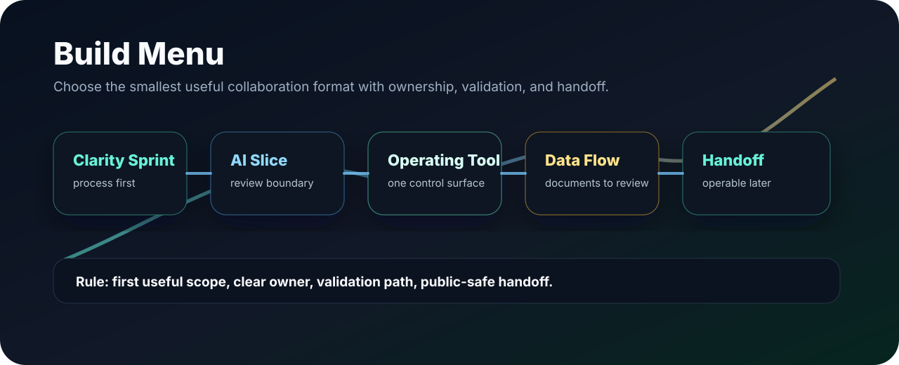
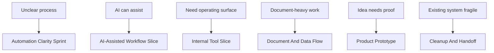

# Build Menu

| Page signal | What this page helps decide |
| --- | --- |
| First step | which collaboration format fits the current process problem |
| Best buyer/user | teams that want useful automation without losing process control |
| Safety boundary | no live automation, POHODA import, private data, or credential exposure from public review |

These formats are designed for teams that want useful automation without losing control of the process.

This is not a fixed product catalog. It is a public-safe menu of collaboration formats for turning manual or unclear work into controlled AI-assisted workflow systems, internal tools, and reviewable product slices.

## Which Format Fits?

| Situation | Best format |
| --- | --- |
| We do not know what to automate first | Automation Clarity Sprint |
| AI can help but decisions need review | AI-Assisted Workflow Slice |
| We need one place to operate work | Internal Tool / Operating Console Slice |
| We process documents or records | Document And Data Flow |
| We need to test an idea | Product Prototype |
| Existing automation is fragile | Automation Cleanup And Handoff |
| We need to understand architecture first | Technical Walkthrough / Architecture Review |

## Engagement Models

| Model | Best when | Typical outputs | Good result | Public-safe boundary |
| --- | --- | --- | --- | --- |
| Automation Clarity Sprint | A process is manual, messy, slow, or unclear, and the first useful build is not obvious | Process map, automation candidates, risk/review points, first-slice recommendation, acceptance criteria | The owner knows what to build first, what to avoid, and how to validate it | No private documents, credentials, endpoints, raw exports, or internal data exposed |
| AI-Assisted Workflow Slice | AI can help with drafting, classification, research, review, or triage, but decisions need owner control | Assistant role, structured input/output, review states, confidence flags, evaluation examples | AI speeds up the workflow without hiding decisions or removing human review | No unreviewed AI action on sensitive or final decisions |
| Internal Tool / Operating Console Slice | A team needs one place to view, review, approve, operate, or export work | Dashboard/control surface concept, queue states, admin/review flow, export/reporting shape, handoff notes | The owner can see and operate the workflow from a clearer surface | Screens and examples stay sanitized; private records stay private |
| Document And Data Flow | Work depends on documents, records, repetitive review, or structured handoff | Intake model, extraction/classification direction, validation checklist, exception handling, owner review flow | Raw inputs become reviewed structured outputs with fewer manual gaps | No accounting correctness, financial performance, or production import claims without evidence |
| Product Prototype | A founder, partner, or internal team needs to make an idea tangible quickly | User journey, interface slice, demo narrative, feedback questions, next-build plan | The idea becomes concrete enough to test, explain, and improve | Prototype claims stay bounded to demo or first-slice scope |
| Automation Cleanup And Handoff | An existing automation is fragile, undocumented, risky, or hard to operate | Workflow inventory, risk notes, validation path, operating notes, maintenance backlog | The system becomes easier to understand, review, and improve | No live workflow changes, imports, or owner-controlled actions without explicit approval |
| Technical Walkthrough / Architecture Review | A reviewer, client, or partner needs to understand the system shape before deeper access | Architecture discussion, sanitized diagrams, risk/review boundary, validation plan, next-step options | Everyone understands the process, system boundary, and first safe action | Controlled access only when appropriate; no secret or private system exposure |

## What Stays Explicit

Every useful scope should name:

- owner,
- user outcome,
- first useful version,
- review boundary,
- sensitive-data boundary,
- validation path,
- handoff owner.

## Not A Fit When

- the goal is to automate everything without defining ownership,
- sensitive live actions must run without review,
- private credentials or client-like data must be exposed publicly,
- success criteria are not defined,
- the first useful version cannot be scoped.
