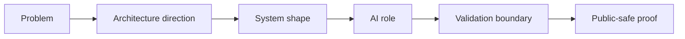
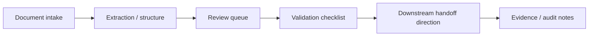
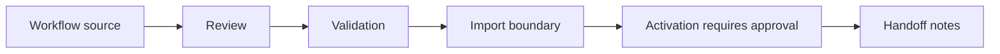

# Case Study Directions

These are public-safe case study directions for Robert Kolesár / KimiAoki and Aureus Automation Lab. They show architecture thinking without exposing private implementation details, credentials, raw workflow exports, client-like data, POHODA internals, production context, or unsupported claims.

They are not claims of production deployment, accounting correctness, trading performance, enterprise compliance, revenue, or customer outcomes unless separately verified.

## Aureus Platform Case Study Map

| Direction | What it demonstrates | Public boundary |
| --- | --- | --- |
| Aureus AOP | Operating platform around agents, GitHub, n8n, validation, evidence, and handoff | Architecture and docs only |
| n8n Workflow Factory | Workflow-as-source and controlled automation changes | No raw private exports |
| Supervisor / Azure capability | Verifier/supervisor integration concept with smoke tests and evidence gates | No Azure secrets or endpoints |
| FineCon / Invoice | Document/invoice workflow with review and POHODA boundary | No accounting correctness claim |
| Web Studio / Experience | Public-safe visual/product surface production | No private screenshots or fake dashboards |

## Case Study Review Map

## FacturaAI / FineCon - Invoice And Document Automation

| Area | Public-safe signal |
| --- | --- |
| Problem type | Document-heavy review and downstream handoff |
| Architecture focus | Intake, structure, review states, validation, evidence |
| AI role | Classification, extraction direction, exception notes |
| Validation boundary | Owner review before downstream action |
| What it demonstrates | Process mapping, approval separation, privacy-safe handoff |
| Private boundary | Documents, credentials, access, workflow IDs, logs, production settings |

### Problem

Invoice and document workflows often involve scattered intake, repetitive review, manual data transfer, unclear exception handling, and downstream systems that require careful owner approval.

### Solution Architecture Direction

A validation-first document automation workstream: intake documents, extract or structure relevant fields, route uncertain cases to review, prepare reviewed data for downstream accounting-style handoff, and preserve evidence.

### System Shape

- inbox or drive intake,
- document parsing direction,
- structured data table,
- review queue,
- exception handling,
- POHODA XML/UBL preparation direction,
- owner approval state,
- audit/evidence notes.

### AI Role

AI can assist with classification, field extraction, draft summaries, and exception notes. It should not silently decide accounting correctness or push final records without owner review.

### Validation Boundary

Structured outputs need validation, exceptions need owner attention, and downstream imports require explicit approval. The public shape stays about architecture and review boundaries, not automatic correctness claims.

### Public-Safe Proof

Public proof can include sanitized architecture diagrams, sample schemas, validation checklists, exception-state examples, and review-state notes.

### What This Demonstrates

- ability to map a document-heavy business process,
- ability to separate extraction from approval,
- understanding of downstream system boundaries,
- validation-first thinking,
- privacy-safe handoff discipline.

### What Stays Private

Private documents, credentials, POHODA access, workflow IDs, webhook URLs, accounting context, raw exports, logs, production settings, and client-like data stay private.

## Aureus Automation Lab - Public Explanation And Product Surface

| Area | Public-safe signal |
| --- | --- |
| Problem type | Private technical work needs a clear public explanation |
| Architecture focus | Public-safe positioning, product surface, review path |
| AI role | Drafting, iteration, QA prompts, content structure |
| Validation boundary | Human-owned claims, privacy boundary, visual QA |
| What it demonstrates | Translating systems into reviewable public surfaces |
| Private boundary | Repo internals, analytics, private screenshots, credentials |

### Problem

AI automation can be difficult to explain when the work is private, technical, or spread across workflows, tools, docs, and product surfaces.

### Solution Architecture Direction

A public-facing surface can explain capability, process, portfolio direction, and collaboration boundaries without exposing private systems.

### System Shape

- public-safe landing or product surface,
- capability sections,
- workflow and architecture visuals,
- review-safe copy,
- CTA or walkthrough path,
- evidence and boundary notes.

### AI Role

AI can assist with content drafts, layout iteration, QA checklists, and review prompts. Human review owns final positioning, privacy boundary, and claims.

### Validation Boundary

Claims need to stay tied to public-safe artifacts, visible product surfaces, or bounded architecture directions. Anything private remains out of the public view.

### Public-Safe Proof

Public proof can include sanitized page structure, content hierarchy, review notes, and design/QA evidence.

### What This Demonstrates

- ability to translate technical systems into clear public explanation,
- understanding of public-safe positioning,
- product-surface thinking,
- review discipline around claims and privacy.

### What Stays Private

Private implementation, repo internals, analytics, private screenshots, business context, credentials, and production settings stay private.

## Aureus OS-Style Internal Operating System Patterns

| Area | Public-safe signal |
| --- | --- |
| Problem type | AI-assisted work needs scope, review, evidence, and handoff |
| Architecture focus | Task intake, role lenses, quality gates, approval boundaries |
| AI role | Draft, classify, reason, summarize, propose next actions |
| Validation boundary | Checklists, review notes, proof packs, blockers |
| What it demonstrates | Control-system thinking around AI-assisted delivery |
| Private boundary | Internal prompts, repos, workflow internals, logs |

### Problem

AI-assisted work can become hard to trust when scope, validation, review, and handoff are not explicit. Teams need a way to move from idea to reviewed output without pretending every AI result is automatically correct.

### Solution Architecture Direction

An internal operating-system pattern can define task intake, role lenses, quality gates, approval boundaries, evidence, and handoff notes for scoped AI-assisted work.

### System Shape

- structured task intake,
- role-based review lenses,
- quality gates,
- evidence notes,
- approval boundaries,
- handoff docs,
- next-step backlog.

### AI Role

AI can help draft, classify, reason, summarize, or propose next actions. It should remain inside clear task scope and review boundaries.

### Validation Boundary

Validation can include checklists, test examples, review notes, proof packs, and explicit blockers for live, sensitive, or owner-controlled actions.

### Public-Safe Proof

Public proof can include operating principles, generic quality gates, sanitized examples, and review-safe handoff templates.

### What This Demonstrates

- ability to design control systems around AI-assisted work,
- understanding of evidence and review loops,
- comfort with multi-step delivery processes,
- practical handoff and operating discipline.

### What Stays Private

Internal prompts, private repositories, workflow internals, business context, customer-like data, credentials, logs, and production settings stay private.

## n8n Workflow Factory / Workflow-As-Source

| Area | Public-safe signal |
| --- | --- |
| Problem type | Workflow changes need review, validation, and import boundaries |
| Architecture focus | Source control, validation gates, activation approval, handoff |
| AI role | Documentation, risk review, test-case drafting |
| Validation boundary | Validate before import or activation |
| What it demonstrates | Workflow-as-system thinking and sensitive-value discipline |
| Private boundary | Raw exports, webhook URLs, endpoints, IDs, runtime state |

### Problem

Automation can become fragile when workflows are edited manually, imported inconsistently, lack validation, or carry sensitive values inside exports.

### Solution Architecture Direction

A workflow-as-source pattern treats workflow JSON and supporting docs as reviewable artifacts with validation gates, import boundaries, and sensitive-value discipline.

### System Shape

- n8n-style orchestration,
- source-controlled workflow files,
- environment-separated configuration,
- import/upsert direction,
- validation checks,
- review notes,
- operating handoff.

### AI Role

AI can assist with workflow documentation, risk review, test-case drafting, and architecture explanation. It should not publish credentials, activate live workflows, or change owner-controlled systems without approval.

### Validation Boundary

Workflow validation should happen before import or activation. Live imports, activation, credential changes, and live mutations should require explicit owner approval.

### Public-Safe Proof

Public proof can include generic workflow shapes, linting concepts, sanitized examples, import checklists, and handoff documentation.

### What This Demonstrates

- ability to think about workflows as reviewable systems,
- awareness of sensitive-value and import boundaries,
- validation-first automation discipline,
- operational handoff thinking.

### What Stays Private

Raw private exports, credentials, webhook URLs, internal endpoints, workflow IDs, private nodes, production logs, runtime state, and client-like data stay private.

## Internal Tools / Product Surfaces

| Area | Public-safe signal |
| --- | --- |
| Problem type | Teams need one clear place to operate work |
| Architecture focus | State, actions, review queues, operating notes |
| AI role | Drafts, summaries, suggestions, triage signals |
| Validation boundary | Sensitive actions stay visible and reviewed |
| What it demonstrates | Process-to-interface product thinking |
| Private boundary | Screenshots, records, endpoints, auth/billing, private implementation |

### Problem

Teams often need a usable surface for operating work: viewing queues, reviewing records, approving actions, exporting data, or explaining a product idea.

### Solution Architecture Direction

A focused internal tool or product slice can expose the right state, actions, and handoff notes without leaking private data.

### System Shape

- dashboard,
- admin panel,
- workflow form,
- review queue,
- status view,
- demo flow,
- operating notes.

### AI Role

AI can help create drafts, summaries, suggestions, and triage signals. Important actions should remain clear, reviewable, and owner-approved.

### Validation Boundary

The slice should show states, edge cases, owner actions, and expected outputs. Sensitive actions require review and should not be hidden inside black-box UI behavior.

### Public-Safe Proof

Public proof can include sanitized UI slices, state models, journey diagrams, handoff notes, and review checklists.

### What This Demonstrates

- ability to convert process requirements into usable interfaces,
- understanding of operator workflows,
- product-slice discipline,
- handoff-ready documentation.

### What Stays Private

Private screenshots, records, customer-like data, internal endpoints, auth/billing settings, production data, and private implementation stay private.
