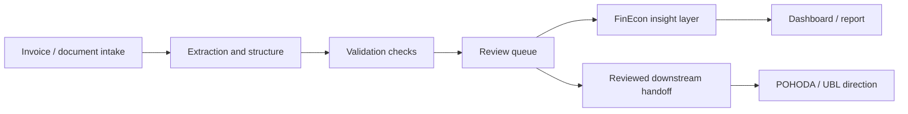

# FinEcon

**FinEcon is the Aureus financial and economic intelligence direction.**

It is designed for businesses that need clearer visibility into invoices, documents, cashflow, costs, revenue, margins, and reporting without turning AI into an uncontrolled accounting authority.

## Product Direction

FinEcon helps structure financial and operational data so owners can review, understand, and act.

```text
documents / invoices / records
-> structured extraction
-> validation checks
-> review queue
-> financial insight layer
-> dashboard / report / handoff
```

The point is not to replace professional accounting. The point is to reduce manual confusion, improve visibility, and create reviewed handoff paths.

## What FinEcon Can Support

| Area | Example use | Review boundary |
| --- | --- | --- |
| **Invoice intelligence** | collect, structure, classify, and prepare invoice data | human review before downstream action |
| **Cashflow view** | understand expected inflows, outflows, and timing | owner interpretation |
| **Cost and revenue overview** | group costs, revenue, suppliers, customers, and periods | validation against source data |
| **Margin and profitability insight** | highlight patterns, anomalies, and questions | business review |
| **Monthly reporting** | draft management reports and summaries | owner approval |
| **POHODA / UBL direction** | prepare reviewed export or handoff shape | no silent final import |

## Architecture Shape



## Why This Matters

Many small businesses do not lack effort. They lack a clean operating view.

Common problems:

- invoices are scattered,
- reporting is delayed,
- cashflow visibility is unclear,
- owner decisions depend on memory,
- documents require repeated manual transfer,
- exceptions are not tracked,
- accounting-style handoffs need care.

FinEcon is designed to make the flow visible, structured, and reviewable.

## AI Role In FinEcon

AI may assist with classification, extraction, summarization, anomaly notes, report drafts, question generation, and exception explanation.

AI should not silently decide accounting correctness, tax treatment, legal interpretation, or final financial truth.

## Public-Safe Proof

Public proof can show architecture diagrams, example schemas, review-state designs, sanitized invoice/document flow, validation checklists, dashboard direction, and handoff boundaries.

Private material stays private: real invoices, credentials, POHODA access, production logs, private endpoints, customer-like data, accounting decisions, and source financial records.

## FinEcon In One Sentence

**FinEcon turns scattered financial and document work into a reviewed intelligence layer for clearer business decisions.**

