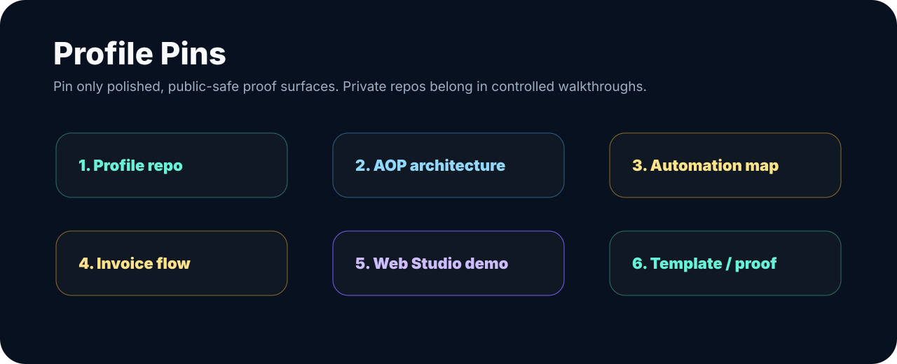

# Profile Pins Guide

| Page signal | What this guide prevents |
| --- | --- |
| Public proof | pinned items should be polished, understandable, and safe for external reviewers |
| Review path | pins should form a portfolio path, not a random repo list |
| Safety boundary | private/internal repos should not be pinned for public reviewers |

## Aureus-Aligned Pin Strategy

Pins should make the profile understandable in under 10 seconds:

For the final candidate list, use [PUBLIC_PIN_CANDIDATES.md](PUBLIC_PIN_CANDIDATES.md).

1. `KimiAoki/KimiAoki` - profile front door.
2. Sanitized Aureus AOP architecture gist or demo repo.
3. Automation Audit public-safe process map gist/demo.
4. Invoice / FineCon public-safe workflow gist/demo.
5. Web Studio / Figma-to-code public-safe demo if visually ready.
6. Template or health demo repo if public/review-safe.

If no public-safe implementation repo exists yet, create a sanitized demo repo instead of exposing private repos.

Do not pin private repos expecting public reviewers to see them. Do not pin unfinished or confusing repos without README/status.

GitHub profile pins are managed manually from the GitHub profile UI. Private repositories should not be pinned for public reviewers because they will not be visible to most visitors.

## Recommended Pin Categories

1. Profile repo `KimiAoki/KimiAoki`.
2. Public/review-safe Automation Lab surface if available.
3. Public demo or sanitized workflow demo if available.
4. Web/product prototype repo if safe.
5. Template or small service repo if polished.
6. Case-study gist if no repo is public-safe.

## Recommended Pin Order

1. `KimiAoki/KimiAoki`.
2. Sanitized Aureus AOP architecture gist or demo repo.
3. Automation Audit public-safe process map gist/demo.
4. Invoice / FineCon public-safe workflow gist/demo.
5. Web Studio / Figma-to-code public-safe demo if visually ready.
6. Template or health demo repo if public/review-safe.

If no public-safe implementation repo exists yet, create a sanitized demo repo instead of exposing private repos.

## Pinning Rules

- Do not pin private repos expecting public reviewers to see them.
- Do not pin unfinished or confusing repos without README/status.
- Do not pin repos that contain private workflow exports, endpoints, credentials, logs, client-like data, or unsupported claims.
- Prefer fewer polished pins over many unclear repos.

## Good Pin Signals

A good pinned repo or gist should have:

- clear purpose,
- public-safe README,
- honest status,
- no private data,
- obvious review path,
- visible architecture or implementation signal.
