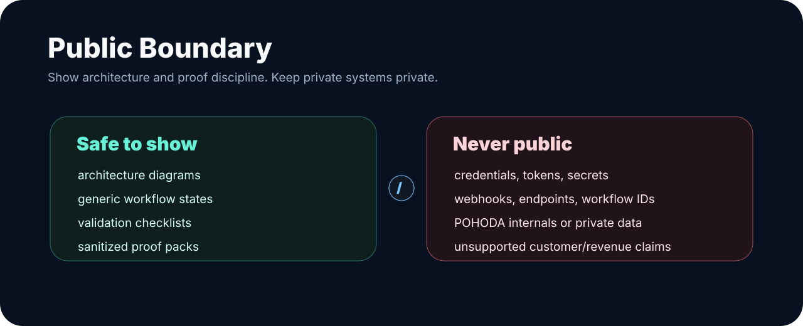

# Public Launch Readiness

This file is the final owner-facing check before changing `KimiAoki/KimiAoki` from private to public.

## GitHub Profile Mechanics

| Check | Required state |
| --- | --- |
| GitHub account | `KimiAoki` |
| Display identity | Robert Kolesár / KimiAoki |
| Special profile repository | `KimiAoki/KimiAoki` |
| Default branch | `main` |
| Profile visibility rule | The profile README appears publicly only when `KimiAoki/KimiAoki` is public |

## First 10 Seconds

An external reviewer should immediately understand:

- Robert Kolesár / KimiAoki is the builder and founder behind Aureus Automation Lab,
- the positioning is AI Product Systems Architect and builder of Aureus Autonomous Operating Platform,
- the work turns unclear business processes into controlled AI-assisted workflow and product systems,
- public proof is shown through architecture, workflow governance, validation, evidence, and handoff,
- private implementation stays private by design.

## What This Profile Highlights

| Created / shaped | Public-safe signal |
| --- | --- |
| Aureus Automation Lab | AI-native automation and product-system direction |
| Aureus Autonomous Operating Platform | GitHub/Codex delivery, n8n workflow governance, validation, evidence, and handoff |
| n8n workflow governance | Workflow-as-source, review gates, credential separation, activation approval |
| Supervisor / Azure capability | Demonstrated API/supervisor integration capability through runtime, smoke tests, and evidence-based validation |
| FineCon / Invoice direction | Document-heavy workflow mapping with review and POHODA boundaries |
| Web Studio / Experience direction | Public-safe product surfaces with design, visual QA, and claims review |

## What Must Stay Private

Do not make public:

- private repositories by default,
- raw n8n workflow exports,
- credentials, tokens, secrets, API keys, cookies, or private auth material,
- webhook URLs, endpoints, workflow IDs, node IDs, private Figma URLs, or private local paths,
- POHODA internals, real company data, client-like records, private payloads, logs, or production settings,
- private screenshots or unsanitized screen recordings.

## Claims Safety

This profile should not claim:

- official Azure certification,
- enterprise compliance certification,
- paying customers,
- customer outcomes,
- revenue,
- production client results,
- accounting correctness,
- trading performance,
- guaranteed ROI.

Allowed wording:

> Azure API and Supervisor integration capability demonstrated through internal runtime, smoke tests and evidence-based validation.

## Reviewer Clarity Check

| Reviewer | They should know where to go |
| --- | --- |
| Recruiter / hiring manager | README, Capabilities, Review Guide |
| CTO / technical reviewer | Solution Architecture, Case Studies, Public Boundary |
| Client / partner | One-Pager, Build Menu, Collaboration |
| Founder / investor reviewer | README, Case Studies, public pages, pin strategy |

## Public Launch Checklist

- [ ] `README.md` starts with `# Robert Kolesár / KimiAoki`.
- [ ] README first screen shows founder/platform positioning and the public-safe hero.
- [ ] README includes `What I Have Built`.
- [ ] Review path is visible near the top.
- [ ] Public/private boundary is clear.
- [ ] All linked Markdown files exist.
- [ ] All referenced images exist.
- [ ] Risky terms were reviewed in context.
- [ ] No private implementation details are exposed.
- [ ] No unsupported claims are present.
- [ ] Owner intentionally changes repository visibility to public.
- [ ] Owner opens the profile in a signed-out browser after publishing.
- [ ] Owner pins only public-safe repos or gists.

## Launch Recommendation

The repository can be made public only after the owner confirms the visibility change. The content is designed to be public-safe, architecture-led, and reviewer-friendly, but public visibility is still a deliberate owner action.
