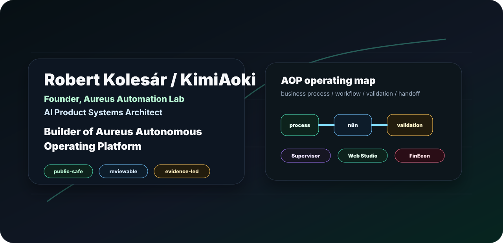
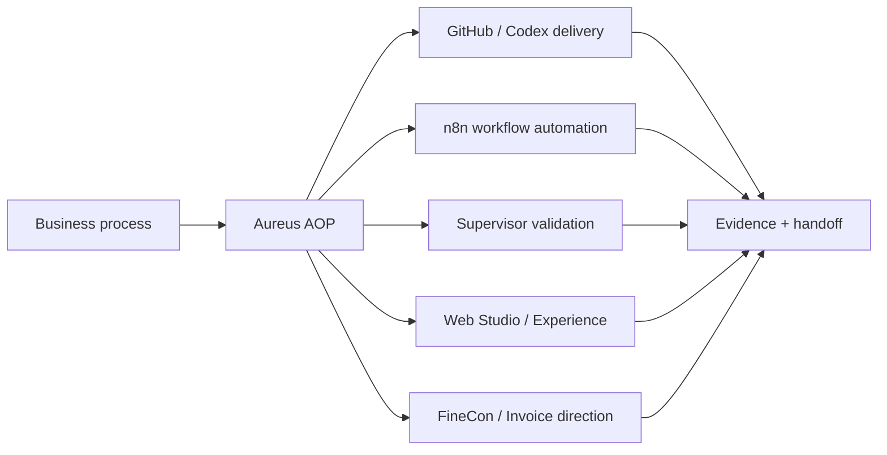
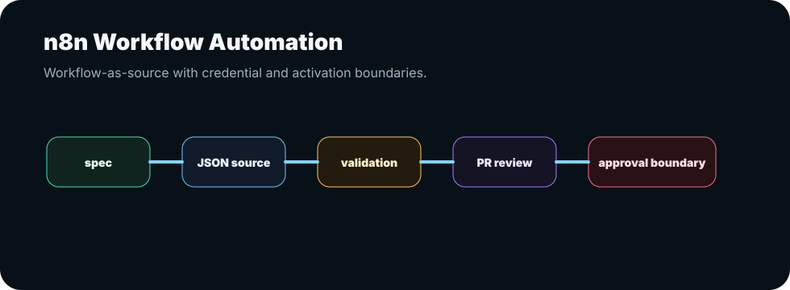
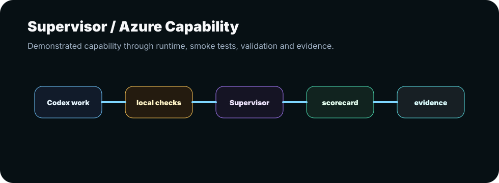
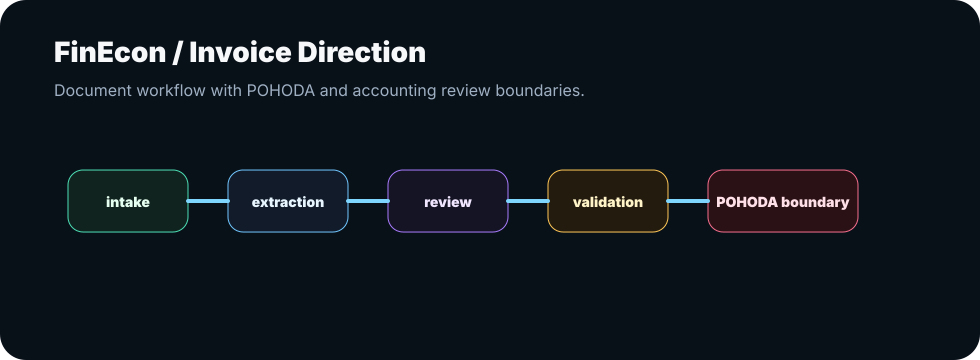
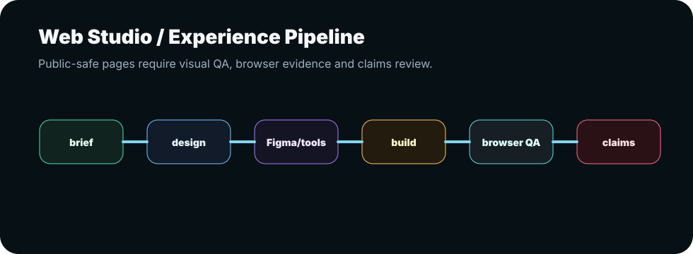
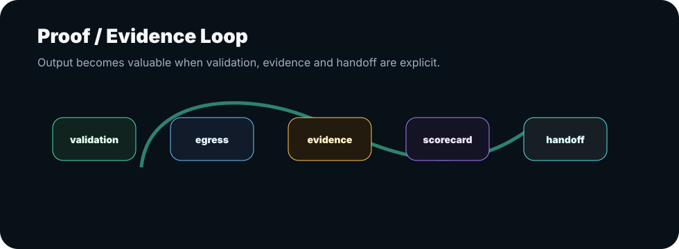

# Robert Kolesár / KimiAoki

**Founder, Aureus Automation Lab** 
**AI Product Systems Architect** 
**Builder of Aureus Autonomous Operating Platform**

I build AI-native workflow and product systems that turn manual business processes into controlled, reviewable, and evidence-backed operating loops.

My work connects business process mapping, n8n workflow automation, Codex/GitHub delivery, Azure/OpenAI Supervisor capability, validation gates, proof/evidence systems, FineCon / Invoice direction, and Web Studio / Experience surfaces.

This profile is a public-safe front door. It shows the architecture, capability map, review path, and proof philosophy without exposing private workflow exports, credentials, endpoints, POHODA internals, client-like data, production settings, or private repositories.

## At A Glance

| Signal | Meaning |
| --- | --- |
| Role | Founder, Aureus Automation Lab |
| Architecture focus | AI product systems, workflow automation, validation, evidence, handoff |
| Platform direction | Aureus Autonomous Operating Platform |
| Core repo | `AureusAutomationLab/n8n-workflows` |
| Main public pages | https://aureus.it.com/automationlab and https://aureus.it.com/invoice |
| Public boundary | Architecture and process shown; private implementation stays private |

## 60-Second System Map

## Review Path

| If you are... | Start here | What you will see |
| --- | --- | --- |
| Recruiter / hiring manager | This README, [Capabilities](CAPABILITIES.md), [Review Guide](REVIEW_GUIDE.md) | Role fit, architecture range, public-safe delivery discipline |
| CTO / technical reviewer | [Solution Architecture](SOLUTION_ARCHITECTURE.md), [Case Studies](CASE_STUDIES.md), [Public Boundary](PUBLIC_BOUNDARY.md) | AOP layers, n8n workflow boundaries, validation, evidence |
| Client / partner | [One-Pager](AUREUS_PUBLIC_PROFILE_ONE_PAGER.md), public pages, [Build Menu](BUILD_MENU.md) | What can be built, how collaboration starts, what stays private |
| Investor / founder reviewer | This README, [Case Studies](CASE_STUDIES.md), [Profile Pins Guide](PROFILE_PINS_GUIDE.md) | Platform direction, proof posture, public-safe portfolio plan |

## What Aureus Automation Lab Does

| System type | Public-safe explanation |
| --- | --- |
| AI workflow automation | Turns manual process steps into controlled AI-assisted workflow systems |
| n8n workflow source | Treats workflows as reviewable source artifacts with credentials kept out |
| GitHub / Codex delivery | Uses branches, PRs, validation, and review notes as delivery evidence |
| Supervisor / Azure capability | Demonstrates Azure API and Supervisor integration capability through internal runtime, smoke tests, and evidence-based validation |
| FineCon / Invoice | Maps document and invoice workflows with review and POHODA boundaries |
| Web Studio / Experience | Creates public-safe product surfaces with visual QA, design system, and claims review |

## Architecture Cards

| Card | Signal |
| --- | --- |
| Process first | Start with owner, decision, input, failure point, and handoff |
| AI with boundaries | AI suggests, classifies, drafts, or checks; humans approve sensitive actions |
| Workflow-as-source | n8n workflows are reviewed as source, not hidden click-only automation |
| Validation-first | Output needs tests, examples, evidence, or review states before trust |
| Public-safe proof | Show architecture and sanitized examples without leaking private systems |
| Handoff-ready | The system should be understandable after the builder leaves |

## Capability Visuals

| Capability | Visual |
| --- | --- |
| n8n workflow automation |  |
| Supervisor validation |  |
| FineCon / Invoice |  |
| Web Studio |  |
| Proof / evidence loop |  |

## Public Links

| Surface | Link | Use |
| --- | --- | --- |
| Automation Lab | https://aureus.it.com/automationlab | Public overview of the automation lab direction |
| Invoice / FineCon | https://aureus.it.com/invoice | Public invoice/document workflow direction |
| Main AOP repo | `AureusAutomationLab/n8n-workflows` | Controlled technical review path |

## Proof Without Exposure

Most serious automation work cannot be shown as raw code because it may contain private process logic, workflow exports, credentials, endpoints, documents, POHODA context, or business data. Instead, this profile shows:

- architecture maps,
- public-safe case study directions,
- n8n workflow governance,
- validation and evidence philosophy,
- Supervisor / Azure capability wording,
- Web Studio and FineCon boundaries,
- controlled review paths.

## What I Do Not Claim

This profile does not claim official Azure certification, enterprise compliance certification, paying customers, production client results, accounting correctness, trading performance, guaranteed ROI, revenue, or production deployment outcomes unless separately verified.

## Portfolio Navigation

| Page | Use it for |
| --- | --- |
| [AUREUS_PUBLIC_PROFILE_ONE_PAGER.md](AUREUS_PUBLIC_PROFILE_ONE_PAGER.md) | Short external-safe profile summary |
| [SOLUTION_ARCHITECTURE.md](SOLUTION_ARCHITECTURE.md) | AOP architecture layers and decision boundaries |
| [CASE_STUDIES.md](CASE_STUDIES.md) | Public-safe system directions |
| [CAPABILITIES.md](CAPABILITIES.md) | Capability map and proof outputs |
| [BUILD_MENU.md](BUILD_MENU.md) | Project formats and collaboration entry points |
| [COLLABORATION.md](COLLABORATION.md) | How work starts, reviews, and hands off |
| [PUBLIC_BOUNDARY.md](PUBLIC_BOUNDARY.md) | What can and cannot be shown publicly |
| [REVIEW_GUIDE.md](REVIEW_GUIDE.md) | Review paths for different audiences |
| [PROFILE_PINS_GUIDE.md](PROFILE_PINS_GUIDE.md) | Manual GitHub pin strategy |
| [PROFILE_COMPLETENESS_CHECK.md](PROFILE_COMPLETENESS_CHECK.md) | Public readiness checklist |
| [PUBLIC_PIN_CANDIDATES.md](PUBLIC_PIN_CANDIDATES.md) | Final public-safe pin candidates |
| [PROFILE_PUBLICATION_GUIDE.md](PROFILE_PUBLICATION_GUIDE.md) | Manual visibility and external-viewer checklist |
| [VISUAL_REVIEW.md](VISUAL_REVIEW.md) | Visual asset and diagram review |

## Technical Walkthrough

I can walk through selected architecture notes, sanitized examples, public-safe workflow shapes, and the Aureus AOP review path after the privacy boundary and context are clear.
