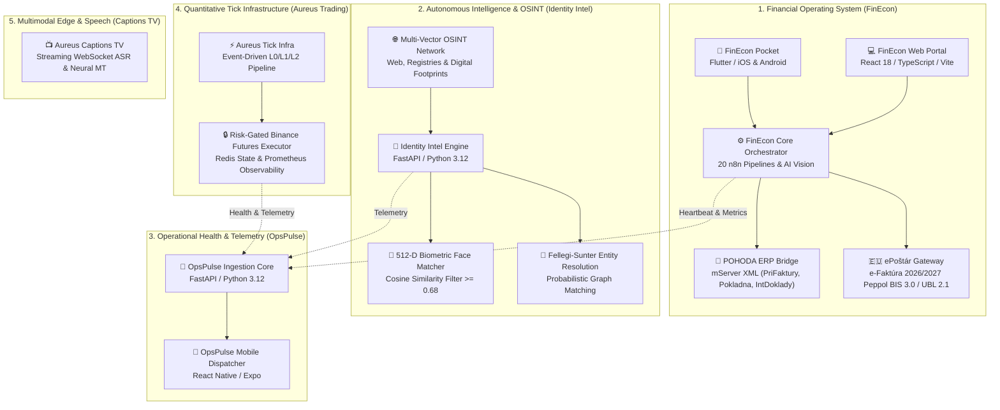
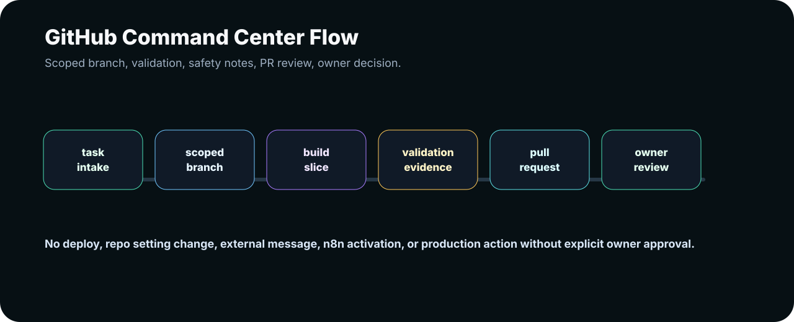

<div align="center">

# 🏛️ AUREUS AUTOMATION LAB
### **Enterprise AI Automation, Financial Operating Systems & High-Throughput Infrastructure**

```
   █████╗ ██╗   ██╗██████╗ ███████╗██╗   ██╗███████╗   ██╗      █████╗ ██████╗ 
  ██╔══██╗██║   ██║██╔══██╗██╔════╝██║   ██║██╔════╝   ██║     ██╔══██╗██╔══██╗
  ███████║██║   ██║██████╔╝█████╗  ██║   ██║███████╗   ██║     ███████║██████╔╝
  ██╔══██║██║   ██║██╔══██╗██╔══╝  ██║   ██║╚════██║   ██║     ██╔══██║██╔══██╗
  ██║  ██║╚██████╔╝██║  ██║███████╗╚██████╔╝███████║██╗███████╗██║  ██║██████╔╝
  ╚═╝  ╚═╝ ╚═════╝ ╚═╝  ╚═╝╚══════╝ ╚═════╝ ╚══════╝╚═╝╚══════╝╚═╝  ╚═╝╚═════╝ 
```

<p align="center">
  <a href="https://github.com/Aureus-Automation-Lab"></a>
  <a href="https://github.com/AureusAutomationLab"></a>
  <a href="docs/products/public-boundary.md"></a>
  <a href="https://aureus.it.com/automationlab"></a>
</p>

<p align="center">
  <strong>Controlled AI automation for companies that require speed, mathematical accuracy, and human-in-the-loop governance.</strong>
</p>

<p align="center">
  Founded & Engineered by <strong>Róbert Kolesár</strong> and <strong>Patrik Trnavský</strong>
</p>

---

[ 📊 Architecture ](#-master-ecosystem-architecture) • 
[ 💼 FinEcon Ecosystem ](#-1-finecon-ecosystem--financial-operating-system) • 
[ 🦅 Identity Intel ](#-2-aureus-identity-intel--autonomous-osint--biometrics) • 
[ 📡 OpsPulse ](#-3-opspulse--telemetry--observability) • 
[ 📈 Trading Infra ](#-4-aureus-trading-infra--quantitative-engine) • 
[ 🛡️ Proof Showroom ](#-public-proof-showroom--tamper-evident-evidence) • 
[ 🚀 Commercial Pilots ](#-commercial-pilots--engagement)

---


</div>

---

## 🗺️ Master Ecosystem Architecture

Aureus Automation Lab operates on a **5-tier unified architecture** designed to bridge physical field operations, machine intelligence, high-consequence enterprise ERPs, and low-latency infrastructure:



---

## 💎 Product Showcase & Platform Suites

<div align="center">

### 💼 1. FinEcon Ecosystem – Financial Operating System
*The premier Slovak & European financial automation suite connecting mobile intake to ERP accounting ledgers.*

</div>

<table>
  <tr>
    <td width="55%">
      <h4>🌟 Key Highlights:</h4>
      <ul>
        <li><strong>FinEcon Pocket (Mobile):</strong> Cross-platform Flutter app for iOS & Android with offline-first capture, local draft restore, and 1-tap in-app approval.</li>
        <li><strong>AI Pre-Accounting Engine:</strong> Automatic Slovak accounting classification (<code>518</code>, <code>501</code>, <code>602</code>, <code>604</code>, <code>511</code>), EU reverse-charge samozdanenie (<code>aInt</code>/<code>bInt</code>), and vehicle fuel statutory splits (CAR 50:50 / 80:20).</li>
        <li><strong>POHODA ERP mServer Bridge:</strong> Schema-validated XML generation for <code>PriFaktury</code>, <code>VydFaktury</code>, <code>Pokladna</code>, and <code>IntDoklady</code> with gated dry-run preflight checks.</li>
        <li><strong>e-Faktúra 2026/2027 & ePoštár Gateway:</strong> Turnkey Peppol BIS 3.0 / UBL 2.1 e-invoicing adapter with HMAC-SHA256 signed push webhook ingress.</li>
      </ul>
      <p>
        <a href="docs/products/finecon.md"></a>
        <a href="https://github.com/AureusAutomationLab/FinEcon"></a>
        <a href="https://github.com/AureusAutomationLab/n8n-workflows"></a>
      </p>
    </td>
    <td width="45%">
      
    </td>
  </tr>
</table>

---

<div align="center">

### 🦅 2. Aureus Identity Intel – Autonomous OSINT & Biometrics
*Tier-1 entity resolution, facial biometrics, and multi-vector intelligence platform.*

</div>

<table>
  <tr>
    <td width="45%">
      
    </td>
    <td width="55%">
      <h4>⚡ Capabilities:</h4>
      <ul>
        <li><strong>Multi-Vector Triangulation:</strong> Correlates names, aliases, emails, phone numbers, registries, and digital footprints.</li>
        <li><strong>512-D Biometric Matcher:</strong> High-precision vector face embeddings with cosine similarity filtering ($\ge 0.68$) to confirm identity across unlinked platforms.</li>
        <li><strong>Fellegi-Sunter Probabilistic Resolution:</strong> Mathematical entity resolution separating homonyms and resolving multi-source profiles.</li>
        <li><strong>NetworkX Knowledge Graph:</strong> In-memory topological graph with native exports for Neo4j, Memgraph, and STIX2.</li>
      </ul>
      <p>
        <a href="https://github.com/AureusAutomationLab/aureus-identity-intel"></a>
      </p>
    </td>
  </tr>
</table>

---

<div align="center">

### 📡 3. OpsPulse – Telemetry & Observability
*Real-time microservice health aggregation, latency telemetry, and anomaly alerting.*

</div>

<table>
  <tr>
    <td width="55%">
      <h4>📊 Core Features:</h4>
      <ul>
        <li><strong>Centralized Ingestion Core:</strong> High-throughput FastAPI (Python 3.12) telemetry service collecting heartbeat signals across all distributed nodes.</li>
        <li><strong>Mobile Monitoring Dashboard:</strong> React Native / Expo client giving executives and operations leads real-time system pulse on iOS & Android.</li>
        <li><strong>Automated Telegram Incident Dispatcher:</strong> Instant multi-channel alert delivery when error thresholds or latency limits are breached.</li>
      </ul>
      <p>
        <a href="https://github.com/AureusAutomationLab/opspulse"></a>
      </p>
    </td>
    <td width="45%">
      
    </td>
  </tr>
</table>

---

<div align="center">

### 📈 4. Aureus Trading Infra – Quantitative Engine
*Event-driven tick processing, order book telemetry, and risk-gated futures execution.*

</div>

* **Deterministic 3-Stage Pipeline:** L0 (Tick Normalization) $\rightarrow$ L1 (Signal Synthesis) $\rightarrow$ L2 (Risk Gate & Execution).
* **Isolated Exchange Key Boundary:** Only the hardened execution daemon holds API keys; zero raw credentials exposed to strategy layers.
* **Observability Stack:** Redis runtime state store paired with native Prometheus exporters and Grafana operational dashboards.

<p align="center">
  <a href="https://github.com/AureusAutomationLab/aureus-trading"></a>
</p>

---

## 🏛️ Public Proof Showroom – Tamper-Evident Evidence

Aureus systems operate under strict **non-repudiation and cryptographic auditability**. Every processed document batch produces a verifiable **Proof Pack** with SHA-256 state hashes:

<div align="center">

| Proof Category | Architectural Diagram | Description & Verification |
| :--- | :---: | :--- |
| **FinEcon Flow & POHODA Gateway** |  | Gated transition from raw mobile capture to verified POHODA mServer XML. |
| **Audit Ledger & Proof Hash** |  | Tamper-evident event ledger storing SHA-256 byte signatures for legal compliance. |
| **Aureus Operating Boundary** |  | Strict boundary ensuring zero private credentials or customer data in public space. |

[👉 Explore the Complete Public Proof Showroom](public-proof/README.md)

</div>

---

## 🛡️ The 4 Golden Principles of Aureus

```text
1. AI Prepares    ──► Models extract, itemize, normalize, and draft candidate records.
2. Humans Approve ──► Certified operators and managers retain 100% review authority.
3. Systems Prove  ──► Every mutation generates an immutable, cryptographic audit pack.
4. Zero Risk      ──► Gated execution, dry-run preflights, and zero unhandled fallbacks.
```

---

## 💼 Commercial Pilots & Engagement

We partner with **accounting bureaus, field-intensive enterprises, and growing SMEs** to implement end-to-end automation with guaranteed ROI:

* 🏢 **FinEcon Pilot Program:** Turnkey deployment of FinEcon Pocket for your field staff + POHODA mServer automated pre-accounting bridge.
* 🔍 **Automation Audit (Process Discovery):** Detailed mapping of manual bottlenecks, ROI modeling, and a phased automation blueprint.
* 🤝 **Monthly Automation Partner Retainer:** Continuous pipeline engineering, 24/7 OpsPulse monitoring, and dedicated infrastructure support.

---

<div align="center">

### 🚀 Ready to Automate Your Business Operations?

[](https://aureus.it.com/automationlab)
[](https://linkedin.com)
[](mailto:kimi.aoki.if@gmail.com)

<br/>

<sub>© 2026 Aureus Automation Lab. Engineered for Autonomous Reliability & Enterprise Excellence.</sub>

</div>
