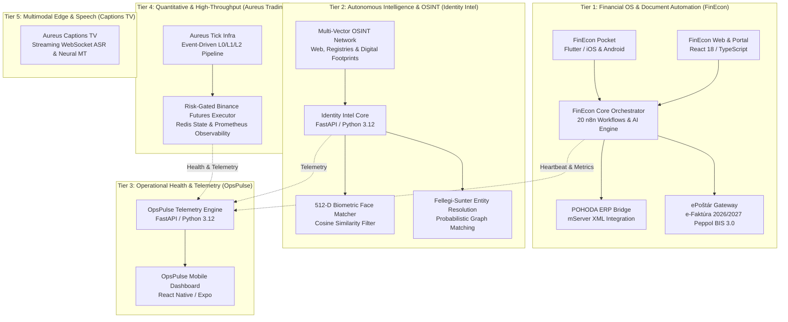

# Aureus Automation Lab

**Controlled AI automation, financial workflow operating systems, autonomous intelligence, and high-throughput enterprise infrastructure.**

Founded & Engineered by **Róbert Kolesár** and **Patrik Trnavský**

---

## The Master Ecosystem Architecture

Aureus Automation Lab is a coherent, **multi-tier enterprise automation and operating platform**:

---

## Products & Platform Suites

| Suite / System | Repository | Primary Purpose | Tech Stack & Output |
| :--- | :--- | :--- | :--- |
| **FinEcon Ecosystem** | [AureusAutomationLab/FinEcon](https://github.com/AureusAutomationLab/FinEcon) [AureusAutomationLab/n8n-workflows](https://github.com/AureusAutomationLab/n8n-workflows) | End-to-end finance operating system: field receipt capture, AI parsing, pre-accounting, POHODA XML bridge, and e-Faktúra 2026/2027 ePoštár gateway. | • **Pocket App:** Flutter (iOS/Android) • **Web:** React 18 / TypeScript / Vite • **Core:** n8n (20 Workflows) / Azure OpenAI • **Gateways:** POHODA mServer & Peppol BIS 3.0 |
| **Aureus Identity Intel** 🦅 | [AureusAutomationLab/aureus-identity-intel](https://github.com/AureusAutomationLab/aureus-identity-intel) | Autonomous OSINT, 512-d biometric face verification, Fellegi-Sunter entity resolution, and knowledge graph intelligence. | • **Engine:** Python 3.12 / FastAPI • **Algorithms:** Cosine Biometrics & Fellegi-Sunter • **Graph:** NetworkX / Neo4j / Stix Export |
| **OpsPulse** | [AureusAutomationLab/opspulse](https://github.com/AureusAutomationLab/opspulse) | Centralized microservice health monitoring, operational telemetry, and anomaly alerting. | • **Backend:** FastAPI / Python 3.12 • **Mobile:** React Native / Expo • **Alerts:** Telegram Dispatcher & Webhooks |
| **Aureus Trading Infra** | [AureusAutomationLab/aureus-trading](https://github.com/AureusAutomationLab/aureus-trading) | Event-driven quantitative tick infrastructure, order book analytics, and risk-gated execution. | • **Engine:** Python 3.11 / Redis • **Observability:** Prometheus & Grafana • **Security:** Hardware-isolated exchange executor |
| **Aureus Captions TV** | [Aureus-Automation-Lab/aureus-captions-tv](https://github.com/Aureus-Automation-Lab/aureus-captions-tv) | Low-latency streaming audio ingestion, real-time speech recognition (ASR), and multilingual subtitle broadcast for Android TV. | • **Server:** Python / WebSockets / Docker • **Target:** Android TV Leanback & Connected Displays |

---

## Microservice Blueprints & Templates

Standardized starter templates for repeatable, compliant service delivery:

* **[aal-worker-template](https://github.com/AureusAutomationLab/aal-worker-template):** Python 3.12 background worker with CLI, JSON logging, and health checks.
* **[aal-web-saas-template](https://github.com/AureusAutomationLab/aal-web-saas-template):** Next.js, TypeScript, and Tailwind CSS web SaaS starter with local auth.
* **[aal-python-service-template](https://github.com/AureusAutomationLab/aal-python-service-template):** FastAPI microservice blueprint with Pydantic contracts and automated pytest suite.

---

## Operating Governance & Delivery Standard

Aureus operates on the **Silicon Valley Tier-1 Autonomous Protocol**:

1. **Human-in-the-Loop Governance:** High-risk actions (accounting ledgers, payments, regulatory filings) require explicit review and authorization gates.
2. **Deterministic State Management:** Zero loose or undocumented scripts; all business pipelines run on versioned, test-verified workflows.
3. **Defense in Depth & Zero Secrets:** Zero credentials or real customer financial records in source repositories; all secrets are managed via hardware/OS-level secret stores.
4. **Verifiable Proof Packs:** Cryptographic SHA-256 signatures generated for every batch of processed financial documents.

---

## Public Documentation & Deep Dives

* 📖 **[FinEcon Product Guide](docs/products/finecon.md)** – Detailed three-pillar architecture and workflow breakdown.
* 🏛️ **[Public Proof Showroom](public-proof/README.md)** – Public-safe architectural evidence, data contracts, and review models.
* 🛡️ **[Public Security Boundary](docs/products/public-boundary.md)** – Strict boundaries protecting proprietary IP and client privacy.
* 💼 **[Engagement & Offer Menu](docs/products/offers.md)** – Pilot programs, automation audits, and monthly partnership retainers.

---

## Public Web Surfaces

* **Main Portal:** [https://aureus.it.com/automationlab](https://aureus.it.com/automationlab)
* **FinEcon Hub:** [https://aureus.it.com/finecon](https://aureus.it.com/finecon)

---

## Summary

Aureus Automation Lab provides unified, production-grade AI automation and finance operating systems connecting mobile capture, intelligent workflows, ERPs, telemetry, and electronic invoicing.
