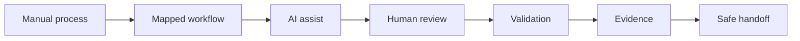

# Róbert Kolesár / KimiAoki

**Founder of Aureus Automation Lab**<br>
AI systems, workflow automation, document automation, FinEcon, and internal operating systems for real business work.


I build controlled AI automation systems for companies that want less manual chaos and more visible execution.

The work usually starts with a simple business problem:

- leads are handled manually,
- invoices and documents are slow to check,
- workflows run but nobody knows what failed,
- reporting depends on spreadsheets and memory,
- AI is used, but without review, evidence, or ownership.

Aureus turns that into a system:

```text
business process
-> workflow map
-> AI-assisted step
-> human review
-> validation
-> evidence
-> safe handoff
```

## What Aureus Builds

| Offer | What it means in plain language | Start here |
| --- | --- | --- |
| **Automation Audit** | We inspect one repeated process and show what should be automated, reviewed, or left manual. | [Build Menu](docs/services/build-menu.md) |
| **n8n Workflow Automation** | We turn repeated work into workflows with clear inputs, approvals, retries, logs, and handoff. | [Automation Lab](docs/services/automation-lab.md) |
| **FinEcon** | We structure invoice, document, cashflow, cost, and reporting flows so owners can review better decisions. | [FinEcon](docs/services/finecon.md) |
| **Internal AI Operating System** | We connect Git, Codex, n8n, validation, proof, and approval gates into a repeatable company workflow. | [Aureus OS](docs/system/aureus-os.md) |
| **Premium AI Website + Automation** | We create public-facing product surfaces connected to real workflows behind the business. | [Capabilities](docs/services/capabilities.md) |

## Why This Matters

Most automation fails because the process underneath is unclear.

A form is submitted.<br>
A row appears in a sheet.<br>
A workflow runs.<br>
Then the real question arrives:

**Who checks the exception?**

That is where Aureus focuses: ownership, review, validation, evidence, and a clean handoff.

## Public Architecture




## How To Review This Repository

| If you are... | Read this | You will understand |
| --- | --- | --- |
| **Potential client** | [One-page profile](docs/overview/one-pager.md) | What Aureus does and where a first project can start |
| **Founder or operator** | [Build menu](docs/services/build-menu.md) | Which offer fits your current bottleneck |
| **Technical reviewer** | [Solution architecture](docs/system/solution-architecture.md) | How the system is structured and bounded |
| **Privacy or claim reviewer** | [Public boundary](docs/proof/public-boundary.md) | What is intentionally not exposed publicly |
| **Collaborator** | [Collaboration guide](docs/services/collaboration.md) | How work starts, gets reviewed, and hands off |

For the full document map, open [docs/README.md](docs/README.md).

## Public Proof, Not Private Dump

This repository is not a dump of private workflows, credentials, customer data, or production systems.

It shows the parts that are safe and useful for review:

- architecture,
- service direction,
- public-safe case studies,
- validation philosophy,
- visual standards,
- proof and privacy boundaries.

## What Stays Private

This public profile intentionally does **not** expose:

- API keys, credentials, or tokens,
- webhook URLs or private endpoints,
- private n8n workflow exports,
- private prompts,
- production logs,
- client-like data,
- POHODA access or accounting data,
- unsupported customer, revenue, ROI, certification, or production-result claims.

## Public Pages

- [Automation Lab](https://aureus.it.com/automationlab)
- [Invoice / FinEcon direction](https://aureus.it.com/invoice)

## One-Line Positioning

**Aureus Automation Lab builds controlled AI workflow systems that turn manual business work into structured execution with review, validation, evidence, and handoff.**
