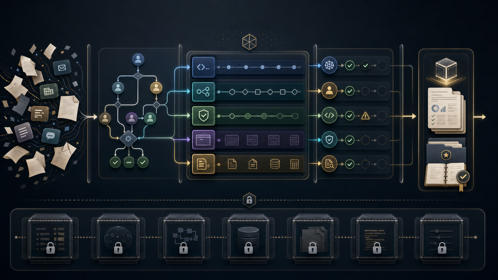
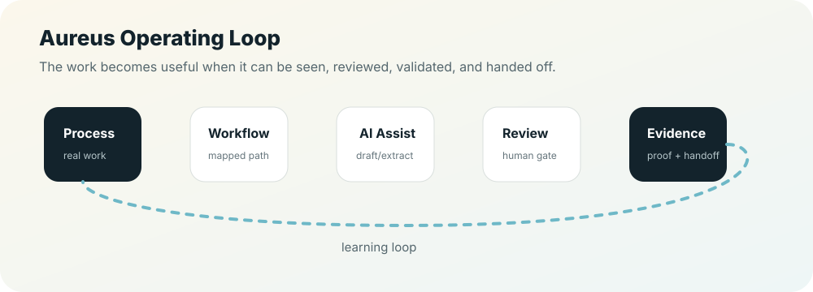

# Aureus Automation Lab

**AI workflow automation for companies that want cleaner operations, faster execution, and systems their team can actually trust.**

Led by **Róbert Kolesár / KimiAoki**<br>
Founder, AI Systems Engineer, workflow automation architect



## What We Do

Aureus Automation Lab helps founders and teams turn repeated manual work into controlled business systems.

We focus on the work that quietly slows a company down: the handoffs between people, spreadsheets, inboxes, documents, CRMs, finance tools, websites, and AI assistants.

| Business area | What we improve |
| --- | --- |
| Sales and lead handling | intake, qualification, follow-up drafts, CRM states, reporting |
| Operations | approvals, task routing, handoffs, reminders, exception handling |
| Documents and invoices | intake, extraction, review queues, proof folders, downstream handoff |
| Internal reporting | daily summaries, owner dashboards, financial visibility, audit trails |
| AI-assisted execution | safe AI drafts, validation, human review, evidence, and controlled next actions |

The goal is not to add more software.

The goal is to make the business easier to operate.

## Why Companies Need This

Most teams already have enough software. The real problem is usually underneath:

- nobody knows who owns the next step,
- approvals disappear in chat,
- invoices wait because a detail is missing,
- leads are followed up too late,
- documents are copied from one place to another,
- workflows run, but nobody can explain what happened when they fail.

Aureus designs the missing operating layer around that work.

```text
messy manual process
-> mapped workflow
-> AI-assisted draft or extraction
-> human review
-> validation
-> evidence
-> safe handoff
```

## Why Choose Aureus

Most automation providers build a workflow and call the job finished.

Aureus builds the operating layer around the workflow:

| What clients usually get elsewhere | What Aureus adds |
| --- | --- |
| A workflow that works once | A process that can be reviewed, repaired, and handed off |
| AI prompts without governance | AI roles with review boundaries and evidence |
| A tool setup | A business process with owner, input, output, exception, and proof |
| A dashboard without source truth | A reviewed flow from intake to decision |
| Technical delivery without sales context | Systems designed to reduce friction, increase trust, and create clearer buyer journeys |

You choose Aureus when you do not just want automation.

You choose Aureus when you want the company to run cleaner.

## Backed By Git, Not Guesswork

This profile is not written as a loose agency brochure. It is a public-safe window into the Aureus source-of-truth system.

The private Aureus Git source contains operating standards, productization notes, workflow governance, revenue packaging, proof-pack rules, FinEcon boundaries, premium web standards, and Git-backed LinkedIn growth architecture. The public profile translates those internal artifacts into language a buyer can understand.

| Public message | Source-backed reality | Why it matters to a buyer |
| --- | --- | --- |
| **Aureus builds controlled automation systems** | Aureus OS v12 defines scope, evidence, validation, quality gates, and A4 approval boundaries | The work is designed to be reviewable, not improvised |
| **Automation Audit is the first commercial step** | The service package catalog defines audit deliverables, timeline, proof required, risks, and follow-up path | A buyer can start small before funding a bigger build |
| **n8n automation is treated as infrastructure** | The workflow standard requires source-of-truth exports, credential boundaries, error branches, retry/backoff, and validation | Workflows are easier to inspect, repair, and hand off |
| **FinEcon is a controlled pilot direction** | Productization docs separate technical proof from accountant validation and production accounting claims | Finance automation stays serious and bounded |
| **Aureus OS is a delivery method, not buzzword branding** | Company operating docs define how ideas, assets, AI systems, and client demand become reliable products and evidence | The same system used to build work is used to explain and sell it |
| **Premium websites are connected to real operations** | Web Studio standards require target user, conversion action, visual QA, accessibility, performance intent, and evidence | The website becomes a sales surface for the actual system |
| **LinkedIn and growth content should come from truth** | The Git-backed editorial engine reads approved source paths, extracts claim status, and blocks unsupported claims | Public content does not drift into generic AI hype |

[Review the public source truth map](docs/proof/source-truth-map.md)

## Core Offers

| Offer | Best for | Outcome |
| --- | --- | --- |
| **Automation Audit** | You know operations are messy, but not what to automate first. | A clear map of the process, risks, quick wins, and the first automation worth building. |
| **n8n Workflow Automation** | You need repeatable workflows with approvals, retries, logs, and ownership. | A reviewable automation system instead of a fragile one-off workflow. |
| **FinEcon Pilot** | You need better visibility around invoices, documents, cashflow, costs, margins, or reports. | A structured review layer for finance/admin work before downstream handoff. |
| **Aureus OS** | You want AI, Git, Codex, n8n, review, validation, and evidence working as one company process. | A repeatable internal operating system for building, checking, and running work. |
| **Premium AI Website + Automation** | You need a public-facing product or service page connected to real operations. | A professional sales surface backed by actual workflows, not just marketing copy. |

## How The Offers Work Together

```text
Automation Audit
-> first workflow / n8n automation
-> FinEcon or operations layer
-> Aureus OS for repeatable execution
-> website and content that explain the system clearly
```

That is the commercial advantage: the public message, the internal workflow, and the operating system support each other.

## From Profile To Revenue

The public profile is designed to support a simple sales path:

```text
clear public explanation
-> buyer understands the problem
-> Automation Audit or workflow review
-> first controlled build
-> proof pack and handoff
-> monthly automation partner or productized pilot
```

The goal is not to look busy on GitHub. The goal is to make the right buyer understand what Aureus can do for them, why the approach is safer than random automation, and what first step they can buy.

## How We Build



1. **Map the real process**<br>
   What starts the work, who owns it, what can fail, and what proof is needed?

2. **Choose the right automation boundary**<br>
   AI can draft, classify, extract, summarize, and check. Sensitive actions stay reviewed.

3. **Build the first useful workflow**<br>
   The first version should solve one real bottleneck, not pretend to automate the whole company.

4. **Add validation and evidence**<br>
   A workflow is not finished just because it runs. It needs logs, review states, examples, and a repair path.

5. **Hand it off clearly**<br>
   The system should make sense after the builder leaves.

## What Makes Aureus Different

We treat automation like business infrastructure, not a clever demo.

That means:

- clear inputs and outputs,
- no blind external sends,
- no hidden credentials in workflow exports,
- human review for sensitive steps,
- source-controlled changes where possible,
- public/private boundaries,
- proof notes and operating handoff,
- content and public explanation that help the market understand what the system does.

## Good First Projects

| If this sounds familiar | Start with |
| --- | --- |
| “We manually chase leads and forget follow-ups.” | Sales workflow audit |
| “Invoices and documents are slow to review.” | FinEcon document flow pilot |
| “Our n8n workflow works, but nobody trusts it.” | Workflow governance rebuild |
| “We need a serious website that explains the real system.” | Premium AI website + automation |
| “I want AI helping my business, but not acting uncontrolled.” | Internal AI operating system slice |

## Review The Public Portfolio

This repository is a public-safe portfolio. It explains how Aureus thinks, builds, validates, and protects sensitive work.

| Start here | Use it for |
| --- | --- |
| [One-page profile](docs/overview/one-pager.md) | Quick external summary |
| [Build menu](docs/services/build-menu.md) | Pick the right first engagement |
| [Capabilities](docs/services/capabilities.md) | See what can be designed and built |
| [Solution architecture](docs/system/solution-architecture.md) | Technical review of system boundaries |
| [Proof index](docs/proof/proof-index.md) | Understand what this public repo proves |
| [Source truth map](docs/proof/source-truth-map.md) | See which public claims are backed by Aureus Git source |
| [Docs map](docs/README.md) | Full supporting library |

## Public Pages

- [Automation Lab](https://aureus.it.com/automationlab)
- [Invoice / FinEcon direction](https://aureus.it.com/invoice)

## One Sentence

**Aureus Automation Lab builds controlled AI workflow systems that help companies turn manual work into visible, reviewable, and reliable execution.**
