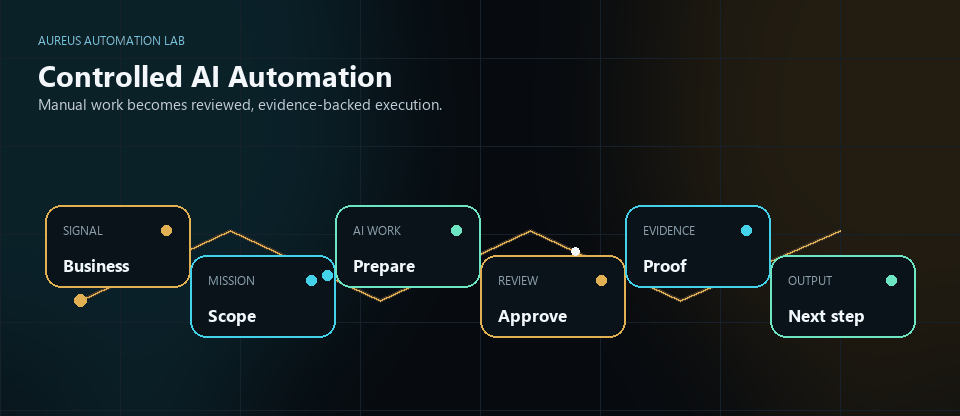
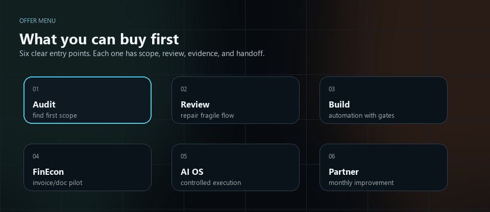
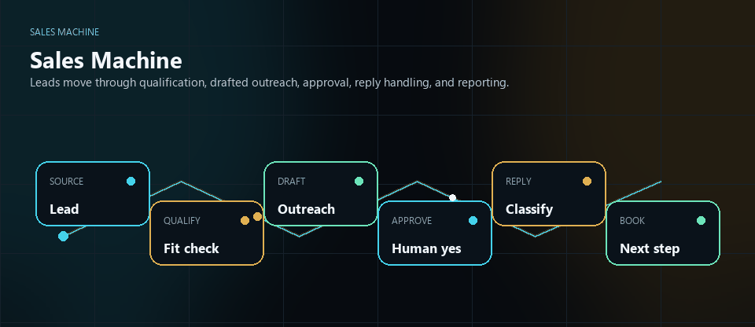
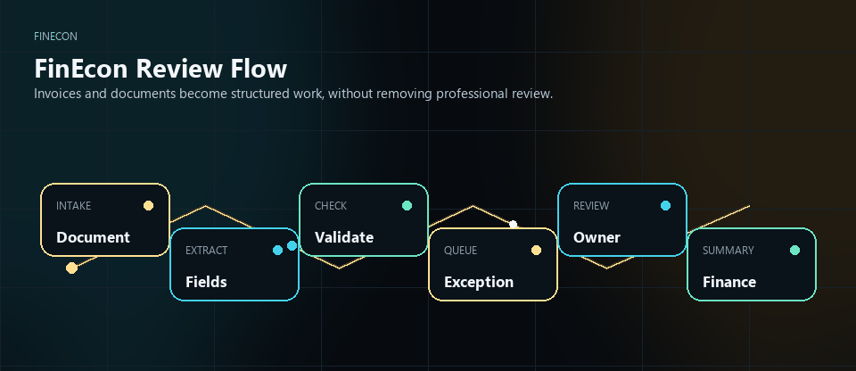
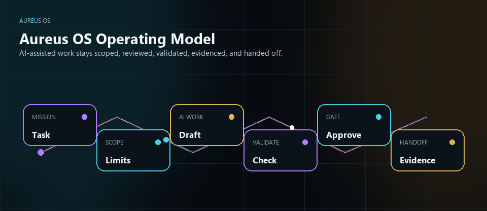

# Aureus Automation Lab

**Controlled AI automation for companies that need work to be clearer, safer, and easier to run.**

Led by **Róbert Kolesár**<br>
**Founder & AI Automation Solution Architect**

I build controlled AI automation systems that turn manual business work into reviewed, evidence-backed workflows.



## What Aureus Does

Aureus helps companies turn scattered manual work into controlled workflows.

That means a real business process is mapped, repeated steps are automated, uncertain steps are routed to review, and the system keeps a record of what happened.

```text
AI prepares.
People approve.
The system keeps evidence.
```

## CV / Recruiter Snapshot

| Signal | Detail |
| --- | --- |
| Role fit | AI Automation Solution Architect |
| Core skills | AI workflow architecture, n8n workflow systems, internal tools, review boundaries, evidence/proof packs, solution architecture |
| Best-fit roles | AI Automation Solution Architect, AI Automation Engineer, Solutions Engineer, Workflow Automation Specialist, Technical Product Operations, Internal Tools / Automation Engineer |
| Review first | [Offer menu](docs/portfolio/offer-menu.md), [public demo flow](docs/portfolio/public-demo-flow.md), [synthetic demo case](docs/portfolio/synthetic-demo-case.md), [solution architecture](docs/portfolio/solution-architecture.md), [public proof showroom](public-proof/README.md) |

Safe CV wording is available in [docs/portfolio/cv-usage.md](docs/portfolio/cv-usage.md).

## What You Can Start With



| Offer | Best when | What you get |
| --- | --- | --- |
| **Automation Audit** | You know work is too manual, but not what to automate first. | A process map, risk points, automation candidates, and first useful scope. |
| **n8n Workflow Review** | Existing workflows feel fragile or unclear. | Review notes, failure points, safety boundaries, and an improvement plan. |
| **n8n Workflow Automation Build** | A repeated process needs a reliable automation. | Workflow design, validation notes, approval boundaries, and handoff direction. |
| **FinEcon Paid Pilot** | Invoice, document, finance, or reporting work needs structure. | A source-backed document workflow direction with Pocket intake, review, bridge handoff, proof notes, and accountant-review boundaries. |
| **AI Operating System Setup** | Your team wants AI-assisted execution without losing control. | Scope, ownership, review, evidence, approvals, and handoff model. |
| **Monthly Automation Partner** | You need ongoing improvement and maintenance. | A practical monthly partnership for automation operations and delivery support. |

Open the full menu: [docs/portfolio/offer-menu.md](docs/portfolio/offer-menu.md)

## Public Demo Flow

Example: a company has manual invoice or process work spread across email, spreadsheets, folders, and memory.

```text
manual business chaos
-> process map
-> controlled AI workflow
-> human review boundary
-> proof notes
-> next-step proposal
```

Open the demo: [docs/portfolio/public-demo-flow.md](docs/portfolio/public-demo-flow.md)

For one concrete fictional example, open [docs/portfolio/synthetic-demo-case.md](docs/portfolio/synthetic-demo-case.md).

## Public Proof Showroom

Each proof path has its own visual because each system explains a different business problem.

| Proof path | Visual | What it shows |
| --- | --- | --- |
| [Sales Machine](public-proof/sales-machine/README.md) |  | sales follow-up with qualification, approval, reply handling, and reporting |
| [FinEcon](public-proof/finecon/README.md) |  | Pocket intake, document review, bridge handoff, proof notes, and accountant validation boundary |
| [Aureus OS](public-proof/aureus-os/README.md) |  | AI-assisted work with scope, validation, action gates, evidence, and handoff |

Open the showroom: [public-proof/README.md](public-proof/README.md)

## Use Case Showcase

The client-ready use-case system translates the portfolio into six sales and pilot conversations: Automation Audit, n8n Review + Build, FinEcon Pocket / Bridge, Sales Machine, Aureus OS / AOP, and Public Proof Website + Automation.

Start with the [Use Case Offer Sheet](docs/use-cases/AUREUS_CLIENT_USE_CASE_OFFER_SHEET.md), then open the [English showcase copy](docs/use-cases/AUREUS_USE_CASE_SHOWCASE_COPY_V5.md), [Slovak showcase copy](docs/use-cases/AUREUS_USE_CASE_SHOWCASE_COPY_V5_SK.md), [client-language PDF design spec](docs/use-cases/AUREUS_USE_CASE_SHOWCASE_DESIGN_SPEC_V6.md), [Instagram carousel export](docs/use-cases/AUREUS_USE_CASE_INSTAGRAM_CAROUSEL_V7.md), or [Git proof map](docs/use-cases/AUREUS_USE_CASE_GIT_PROOF_MAP.md).

## Why This Is Different

Most automation projects stop at "the workflow runs."

Aureus cares about the part companies actually depend on:

- who owns the next step,
- what AI may prepare,
- what a person must approve,
- what happens when something fails,
- what evidence remains,
- and whether the team can understand the system after handoff.

That is the difference between a clever demo and a working operating layer.

## Proof Without Exposure


This profile shows architecture thinking, demo flows, proof-pack structure, case-study directions, offer boundaries, and review models.

It does **not** expose private implementation, real customer data, credentials, production context, or unsupported result claims. The full boundary is documented in [docs/portfolio/public-boundary.md](docs/portfolio/public-boundary.md).

## Choose Your Review Path

| If you are a... | Start here | What to look for |
| --- | --- | --- |
| **Client / partner** | [docs/portfolio/offer-menu.md](docs/portfolio/offer-menu.md) and [docs/portfolio/public-demo-flow.md](docs/portfolio/public-demo-flow.md) | what you can buy first and how the work becomes safer |
| **Technical reviewer** | [docs/portfolio/solution-architecture.md](docs/portfolio/solution-architecture.md) | system boundaries, validation, review gates, evidence, and handoff |
| **Recruiter / hiring manager** | [docs/portfolio/capabilities.md](docs/portfolio/capabilities.md) | AI systems architecture, automation design, internal tools, and delivery discipline |

## Portfolio Library

The root is intentionally clean. Supporting material lives in [docs/portfolio](docs/portfolio/) and deeper proof packages live in [public-proof](public-proof/README.md).

| Page | Purpose |
| --- | --- |
| [Offer menu](docs/portfolio/offer-menu.md) | clear commercial starting points |
| [Public demo flow](docs/portfolio/public-demo-flow.md) | one simple public-safe demo |
| [Synthetic demo case](docs/portfolio/synthetic-demo-case.md) | fictional invoice review example |
| [Use Case Offer Sheet](docs/use-cases/AUREUS_CLIENT_USE_CASE_OFFER_SHEET.md) | client-ready first conversation and pilot menu |
| [Use Case Showcase EN](docs/use-cases/AUREUS_USE_CASE_SHOWCASE_COPY_V5.md) | 12-page English showcase copy |
| [Use Case Showcase SK](docs/use-cases/AUREUS_USE_CASE_SHOWCASE_COPY_V5_SK.md) | 12-page Slovak showcase copy |
| [Use Case Showcase PDF Design](docs/use-cases/AUREUS_USE_CASE_SHOWCASE_DESIGN_SPEC_V6.md) | pro-tier layout, client-language V7 export rules, and safety constraints |
| [Use Case Instagram Carousel](docs/use-cases/AUREUS_USE_CASE_INSTAGRAM_CAROUSEL_V7.md) | 1080x1350 mobile carousel export for Instagram |
| [FinEcon Pocket / Bridge one-pager](docs/use-cases/FINECON_POCKET_BRIDGE_USE_CASE_ONE_PAGER.md) | source-backed FinEcon client explanation |
| [FinEcon source-backed status](docs/proof/finecon-source-backed-status.md) | public-safe summary of FinEcon Pocket, bridge, proof, and accounting boundaries |
| [Solution architecture](docs/portfolio/solution-architecture.md) | technical architecture snapshot |
| [Capabilities](docs/portfolio/capabilities.md) | role and capability overview |
| [Pro-tier case studies](docs/portfolio/case-studies.md) | public-safe case studies across Aureus offers and project lines |
| [Public boundary](docs/portfolio/public-boundary.md) | what stays private |
| [Review guide](docs/portfolio/review-guide.md) | review path by audience |
| [CV usage](docs/portfolio/cv-usage.md) | safe wording for CV, LinkedIn, and recruiter messages |

## Current Public Boundary

This profile does not claim customer results, production deployments, accounting correctness, tax or legal advice, trading performance, official security certification, public access to private systems, or promised revenue / ROI.

It is a public portfolio for controlled AI automation design, review boundaries, proof-safe delivery, and business process clarity.

## Validate This Profile

```powershell
python scripts/validate-public-portfolio.py
```

## One Sentence

Aureus Automation Lab turns manual business work into controlled AI-assisted workflows with review, evidence, and clear next steps.
