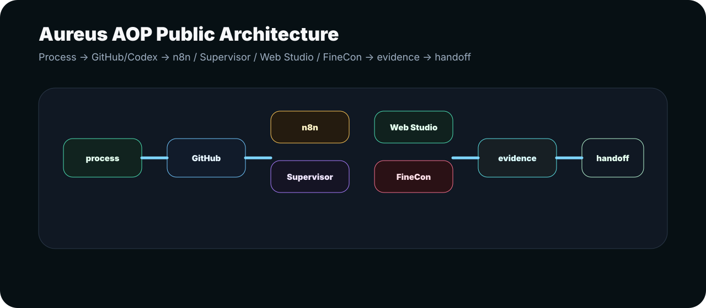
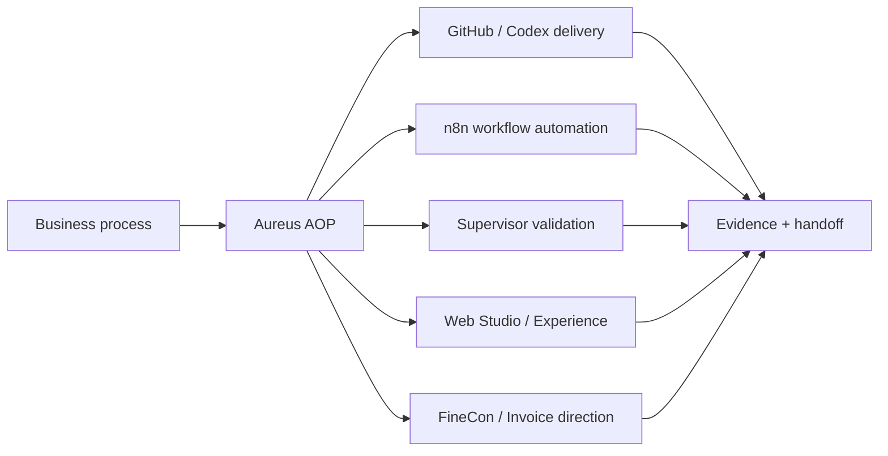
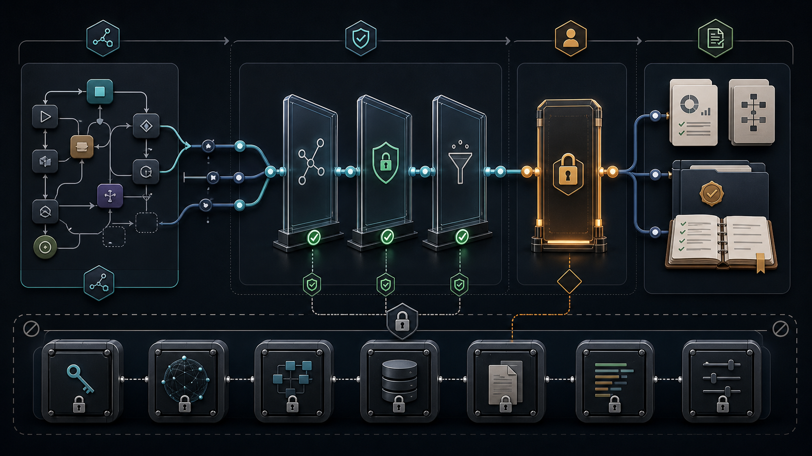
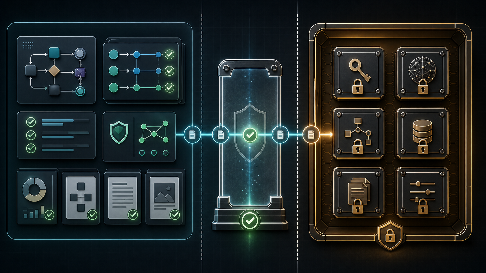
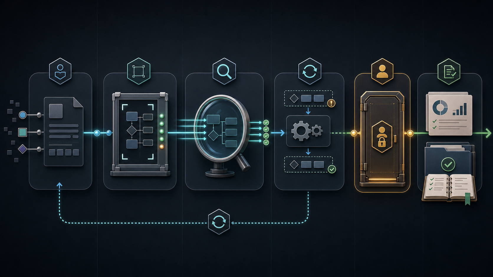
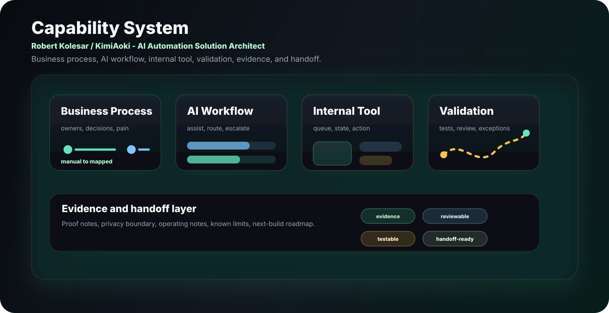
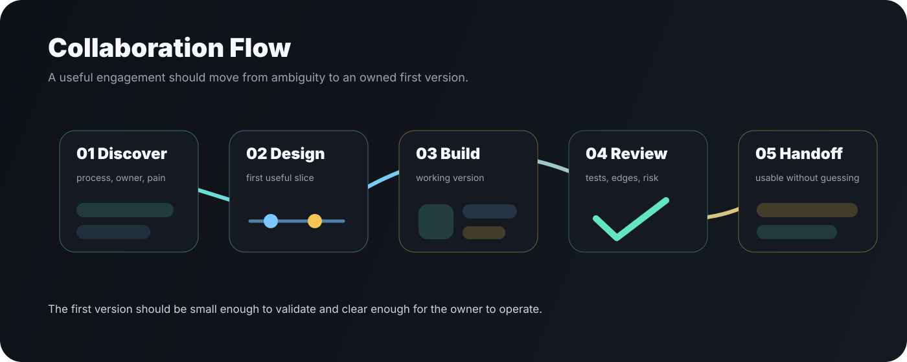
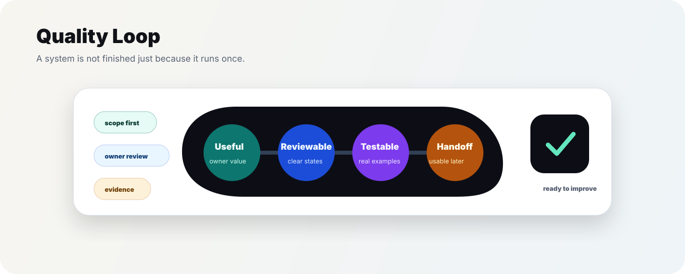

# Robert Kolesár / KimiAoki

**Founder, Aureus Automation Lab** 
**AI Product Systems Architect** 
**Builder of Aureus Autonomous Operating Platform**

Public-safe concept visual. Not a screenshot, not customer proof, not production evidence.

I build AI-native workflow and product systems that turn unclear manual business processes into controlled, reviewable, and evidence-backed operating loops.

My work connects business process mapping, n8n workflow automation, Codex/GitHub delivery, Azure/OpenAI Supervisor capability, validation gates, proof/evidence systems, FineCon / Invoice direction, and Web Studio / Experience surfaces.

This profile is a public-safe front door. It shows architecture, system thinking, review paths, and proof philosophy without exposing private workflow exports, credentials, endpoints, POHODA internals, client-like data, production settings, or private repositories.

## At A Glance

| Signal | Meaning |
| --- | --- |
| Identity | Robert Kolesár / KimiAoki |
| Role | Founder, Aureus Automation Lab; AI Product Systems Architect |
| Platform | Aureus Autonomous Operating Platform |
| Core strength | Turning manual processes into controlled AI-assisted workflow systems |
| Public proof style | Architecture maps, sanitized case studies, validation/evidence notes |
| Main public pages | https://aureus.it.com/automationlab and https://aureus.it.com/invoice |

## Review Path

| If you are... | Start here | What you will see |
| --- | --- | --- |
| Recruiter / hiring manager | [Capabilities](CAPABILITIES.md), [Review Guide](REVIEW_GUIDE.md) | Role fit, stack, architecture range, public-safe delivery discipline |
| CTO / technical reviewer | [Solution Architecture](SOLUTION_ARCHITECTURE.md), [Case Studies](CASE_STUDIES.md), [Public Boundary](PUBLIC_BOUNDARY.md) | AOP layers, workflow boundaries, validation, evidence, risk handling |
| Client / partner | [One-Pager](AUREUS_PUBLIC_PROFILE_ONE_PAGER.md), [Build Menu](BUILD_MENU.md), [Collaboration](COLLABORATION.md) | What can be built, how work starts, what stays private |
| Founder / investor reviewer | This README, [Case Studies](CASE_STUDIES.md), [Profile Pins Guide](PROFILE_PINS_GUIDE.md) | Platform direction, proof posture, public-safe portfolio plan |

## Public Architecture Snapshot

## What Aureus Automation Lab Does

| System type | Public-safe explanation | Typical artifact |
| --- | --- | --- |
| AI workflow automation | Turns manual process steps into controlled AI-assisted workflows | Process map, review states |
| n8n workflow source | Treats workflows as reviewable source artifacts, not hidden click-only automation | Workflow boundary map |
| GitHub / Codex delivery | Uses branches, PRs, validation, and review notes as delivery evidence | PR path, proof notes |
| Supervisor / Azure capability | Demonstrated integration capability through internal runtime, smoke tests, and evidence-based validation | Supervisor capability note |
| FineCon / Invoice | Maps document and invoice workflows with review and POHODA boundaries | Intake/review/handoff flow |
| Web Studio / Experience | Creates public-safe product surfaces with visual QA, design system, and claims review | Page proof pack |

## Workflow Governance Visual

Public-safe concept visual. Not a screenshot, not customer proof, not production evidence.

The important signal is not “I have private automations.” The signal is that automation work is governed: source, review, validation, approval, credential separation, evidence, and handoff.

## Architecture Cards

| Card | Signal |
| --- | --- |
| Process first | Start with owner, decision, input, failure point, and handoff |
| AI with boundaries | AI suggests, classifies, drafts, or checks; humans approve sensitive actions |
| Workflow-as-source | n8n workflows are reviewed as source, not hidden click-only automation |
| Validation-first | Output needs tests, examples, evidence, or review states before trust |
| Public-safe proof | Show architecture and sanitized examples without leaking private systems |
| Handoff-ready | The system should be understandable after the builder leaves |

## Proof Without Exposure

Most serious automation work cannot be shown as raw code because it may contain private process logic, workflow exports, credentials, endpoints, documents, POHODA context, or business data. Instead, this profile shows:

- architecture maps,
- public-safe case study directions,
- n8n workflow governance,
- validation and evidence philosophy,
- Supervisor / Azure capability wording,
- Web Studio and FineCon boundaries,
- controlled review paths.

## What I Do Not Claim

This profile does not claim official Azure certification, enterprise compliance certification, paying customers, production client results, accounting correctness, trading performance, guaranteed ROI, revenue, or production deployment outcomes unless separately verified.

## Visual System

These visuals are not decorative AI images. Each one has a review job.

| Visual slot | What it should prove | Asset |
| --- | --- | --- |
| Profile hero | Manual process becomes architecture, validation, private boundary, and handoff |  |
| Workflow governance | Workflow source moves through review gates, approval, credential separation, evidence, and handoff |  |
| Public boundary | Public-safe proof passes through a controlled boundary while private implementation stays sealed |  |
| Supervisor validation | Worker output moves through contract check, supervisor review, repair loop, approval, and evidence |  |
| Capability system | Aureus capabilities connect into an operating model |  |
| Collaboration flow | Work moves from discovery to architecture, build, review, handoff, and iteration |  |
| Quality loop | Scope, tests, review, evidence, handoff, and iteration are part of delivery |  |

## Portfolio Navigation

| Page | Use it for |
| --- | --- |
| [AUREUS_PUBLIC_PROFILE_ONE_PAGER.md](AUREUS_PUBLIC_PROFILE_ONE_PAGER.md) | Short external-safe profile summary |
| [SOLUTION_ARCHITECTURE.md](SOLUTION_ARCHITECTURE.md) | AOP architecture layers and decision boundaries |
| [CASE_STUDIES.md](CASE_STUDIES.md) | Public-safe system directions |
| [CAPABILITIES.md](CAPABILITIES.md) | Capability map and proof outputs |
| [BUILD_MENU.md](BUILD_MENU.md) | Project formats and collaboration entry points |
| [COLLABORATION.md](COLLABORATION.md) | How work starts, reviews, and hands off |
| [PUBLIC_BOUNDARY.md](PUBLIC_BOUNDARY.md) | What can and cannot be shown publicly |
| [REVIEW_GUIDE.md](REVIEW_GUIDE.md) | Review paths for different audiences |
| [PROFILE_IMAGEGEN_PRODUCTION_GUIDE.md](PROFILE_IMAGEGEN_PRODUCTION_GUIDE.md) | Image 2 production workflow and acceptance gate |
| [PROFILE_IMAGE2_PROMPT_PACK.md](PROFILE_IMAGE2_PROMPT_PACK.md) | Prompt system for future profile visuals |
| [PROFILE_VIDEO_STORYBOARD.md](PROFILE_VIDEO_STORYBOARD.md) | Azure/Sora-ready video concept package |
| [PROFILE_PINS_GUIDE.md](PROFILE_PINS_GUIDE.md) | Manual GitHub pin strategy |
| [PROFILE_COMPLETENESS_CHECK.md](PROFILE_COMPLETENESS_CHECK.md) | Public readiness checklist |
| [PROFILE_PUBLICATION_GUIDE.md](PROFILE_PUBLICATION_GUIDE.md) | Manual visibility and external-viewer checklist |
| [VISUAL_REVIEW.md](VISUAL_REVIEW.md) | Visual asset and diagram review |

## Technical Walkthrough

I can walk through selected architecture notes, sanitized examples, public-safe workflow shapes, and the Aureus AOP review path after the privacy boundary and context are clear.
