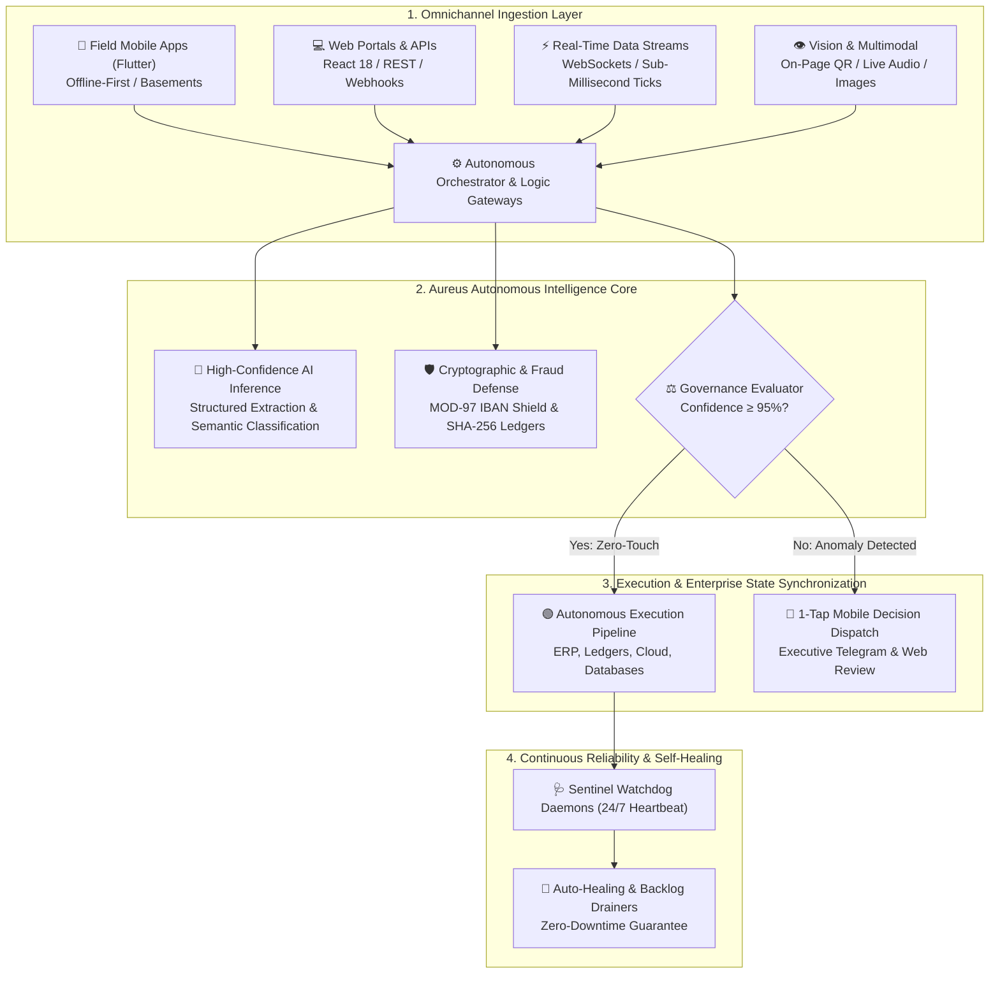

<div align="center">


<br/>

<p align="center">
  <a href="https://github.com/AureusAutomationLab"></a>
  <a href="https://github.com/AureusAutomationLab"></a>
  <a href="https://github.com/AureusAutomationLab"></a>
  <a href="https://github.com/AureusAutomationLab"></a>
</p>

<p align="center">
  <strong>The Autonomous Systems Engineering Lab &amp; Custom Automation Factory.</strong><br/>
  We design, engineer, and deploy high-reliability autonomous software systems that eliminate human friction, connect fragmented enterprise stacks, and run 24/7 with zero downtime.
</p>

<p align="center">
  Architected &amp; Engineered by <strong>Róbert Kolesár</strong> &amp; <strong>Patrik Trnavský</strong>
</p>

---

[ ⚡ The Aureus Thesis ](#-the-aureus-thesis-if-it-has-an-api-or-human-friction-we-automate-it) • 
[ 🛠️ Core Engineering Disciplines ](#-what-we-build--core-engineering-disciplines) • 
[ 🏆 Featured Production Flagships ](#-featured-production-flagships) • 
[ ⚖️ The Competitive Moat ](#-why-enterprises-choose-aureus-automation-lab) • 
[ 🔄 The 30-Day Deployment Model ](#-how-we-work-from-audit-to-production-in-30-days) • 
[ 🚀 Commercial Engagement ](#-commercial-pilots--engagement)

---

</div>

## ⚡ The Aureus Thesis: "If It Has an API or Human Friction, We Automate It"

Most enterprises lose thousands of productive hours and bleed revenue due to a single structural failure: **the operational gap between disconnected systems and repetitive human labor.**

Employees copy-paste between spreadsheets and ERPs, managers manually review routine approvals, and critical processes stall when a key employee is out of office. Off-the-shelf "no-code" tools (like basic Zapier zaps) break silently on edge cases and cannot handle complex enterprise logic.

**Aureus Automation Lab operates on a fundamentally different standard:**
* **We Build Full-Stack Autonomous Systems:** We don't just connect two APIs—we engineer deterministic, fault-tolerant software architectures tailored to your exact business operations.
* **Autonomous by Exception:** 90%+ of repetitive transactions run touchless. Human operators are engaged exclusively when a genuine risk, anomaly, or strategic decision requires executive approval.
* **Self-Healing Infrastructure:** Our deployed systems feature autonomous sentinel watchdogs that continuously monitor health, auto-heal crashed services, and drain backlogged queues with zero manual intervention.

---

## 🗺️ Master Autonomous Systems Topology



---

## 🛠️ What We Build – Core Engineering Disciplines

We engineer custom end-to-end automation across six mission-critical domains:

<table width="100%">
  <tr>
    <td width="50%" valign="top">
      <h3>🤖 1. Autonomous AI Agents &amp; Workflows</h3>
      <p><em>Turn complex business rules into self-governing digital workforces.</em></p>
      <ul>
        <li><strong>Multi-Agent Swarms:</strong> Coordinated AI agents that research, cross-reference, and execute multi-step workflows.</li>
        <li><strong>Document Intelligence:</strong> Extraction of line items, terms, and tables from messy contracts, PDFs, and receipts.</li>
        <li><strong>Deterministic Fallbacks:</strong> Strict rule-based guardrails ensuring AI models never hallucinate or invent data.</li>
      </ul>
    </td>
    <td width="50%" valign="top">
      <h3>🏢 2. ERP, Accounting &amp; Compliance</h3>
      <p><em>Native bridges into legacy enterprise software and statutory standards.</em></p>
      <ul>
        <li><strong>POHODA ERP Deep Bridge:</strong> Direct XML mServer automation for received invoices, cash slips, and general ledgers.</li>
        <li><strong>e-Invoicing 2027 (Peppol BIS 3.0):</strong> Turnkey European B2B e-invoicing compliance (EN 16931) without aggregator tolls.</li>
        <li><strong>Statutory Pre-Accounting:</strong> Automatic account mapping (501, 518, 602), VAT reverse-charge, and fuel tax rules.</li>
      </ul>
    </td>
  </tr>
  <tr>
    <td width="50%" valign="top">
      <h3>⚡ 3. Real-Time &amp; Quantitative Infrastructure</h3>
      <p><em>Sub-millisecond data processing for finance and critical operations.</em></p>
      <ul>
        <li><strong>Tick Telemetry Pipelines:</strong> Event-driven order book normalization and low-latency microsecond processing.</li>
        <li><strong>Algorithmic Execution Engines:</strong> Risk-gated automated trading infrastructure with Redis caching and fail-safes.</li>
        <li><strong>WebSocket Streaming:</strong> Bi-directional live telemetry feeds for high-frequency trading and monitoring.</li>
      </ul>
    </td>
    <td width="50%" valign="top">
      <h3>👁️ 4. Multimodal AI, OSINT &amp; Vision</h3>
      <p><em>Computer vision, audio processing, and graph intelligence.</em></p>
      <ul>
        <li><strong>Real-Time Speech &amp; Subtitling:</strong> Live streaming speech-to-text (ASR) and neural translation pipelines.</li>
        <li><strong>Biometric Vector Matching:</strong> 512-dimensional face vector embeddings with cosine similarity filters.</li>
        <li><strong>Graph Entity Resolution:</strong> Fellegi-Sunter probabilistic linking to map complex organizational networks.</li>
      </ul>
    </td>
  </tr>
  <tr>
    <td width="50%" valign="top">
      <h3>📱 5. Fullstack Web &amp; Offline-First Mobile</h3>
      <p><em>Intuitive client interfaces built for field crews and executives.</em></p>
      <ul>
        <li><strong>Offline-First Mobile (Flutter):</strong> Capture data in basements, warehouses, or remote sites with zero network dependency.</li>
        <li><strong>Modern Web Platforms:</strong> Production-grade React 18, Next.js 15, TypeScript, and Vite dashboards.</li>
        <li><strong>1-Tap Review Interfaces:</strong> Streamlined review UIs for mobile and web, turning 5-minute tasks into 1-second taps.</li>
      </ul>
    </td>
    <td width="50%" valign="top">
      <h3>🔒 6. Hardened Cloud DevOps &amp; Sentinel 24/7</h3>
      <p><em>Production infrastructure engineered for zero downtime and bank-grade security.</em></p>
      <ul>
        <li><strong>Autonomous Sentinel Watchdogs:</strong> System daemons that detect service hangs and auto-restart failed containers.</li>
        <li><strong>Zero-Trust Mesh Networking:</strong> Secure peer-to-peer Tailscale encrypted mesh linking servers and client workstations.</li>
        <li><strong>Bank-Grade Security:</strong> Cryptographic SHA-256 state proofs, ISO 13616 check digits, and hardware-isolated secrets.</li>
      </ul>
    </td>
  </tr>
</table>

---

## 🏆 Featured Production Flagships

The following systems are not conceptual prototypes—they are **live, fully engineered production flagships** architected by Aureus Automation Lab:

### 1. 💼 [FinEcon](https://github.com/AureusAutomationLab/FinEcon) – Autonomous Financial Operating System &amp; Compliance Shield
* **The Mission:** Eliminating 90% of manual bookkeeping across the Stormware POHODA ecosystem.
* **Core Tech:** Flutter mobile app (offline-first), 20 governed automation pipelines, Master Security Gateway, MOD-97 IBAN Fraud Shield, State VAT registry verification (FS SR / VIES), and native Peppol BIS 3.0 ePoštár dispatch.
* **Benchmark:** Sub-300ms verification latency; 99% Autopilot confidence; 100% test pass rate.

### 2. 📈 [Aureus Trading Infra](https://github.com/AureusAutomationLab) – Quantitative Telemetry &amp; Algorithmic Execution
* **The Mission:** High-throughput, event-driven cryptocurrency market intelligence and automated futures execution.
* **Core Tech:** L0/L1/L2 normalized tick ingestion pipeline, Redis state storage, Prometheus metric exporters, and hardware-isolated execution daemons with strict drawdown risk gates.

### 3. 🦅 [Aureus Identity Intel](https://github.com/AureusAutomationLab) – Autonomous OSINT &amp; Biometric Knowledge Graph
* **The Mission:** Enterprise background intelligence, threat detection, and entity resolution across global public registries.
* **Core Tech:** FastAPI / Python 3.12, 512-dimensional facial biometric vector matching ($\text{Cosine} \ge 0.68$), probabilistic Fellegi-Sunter entity resolution, and NetworkX / Memgraph graph topologies.

### 4. 📺 [Aureus Captions TV](https://github.com/AureusAutomationLab) – Real-Time Multimodal Speech Recognition
* **The Mission:** Ultra-low-latency automated subtitling and neural translation for live broadcasting and video feeds.
* **Core Tech:** Streaming WebSocket speech-to-text (ASR) engine, localized neural translation models, and real-time caption overlay generation.

### 5. 📡 [OpsPulse Telemetry](https://github.com/AureusAutomationLab) – Distributed Infrastructure Observability
* **The Mission:** Real-time health monitoring and automated incident dispatch for distributed microservices.
* **Core Tech:** FastAPI heartbeat collection engine, multi-channel Telegram incident dispatcher, and React Native executive mobile monitor.

---

## ⚖️ Why Enterprises Choose Aureus Automation Lab

| Dimension | Legacy IT Agencies | Generic No-Code Tools (Zapier/Make) | 🏛️ Aureus Automation Lab |
| :--- | :---: | :---: | :---: |
| **Engineering Standard** | Slow, bloated consulting | Fragile, breaks on edge cases | 🟢 **Senior Tier-1 Systems Architecture** |
| **Operational Paradigm** | Manual human steps | "Blind" unmonitored triggers | 🟢 **Autonomous by Exception (Touchless 90%+)** |
| **ERP & Legacy Integration** | Clunky CSV exports | Unsupported / Impossible | 🟢 **Native bidirectional XML/API bridges** |
| **Security & Cryptography** | Exposed credentials | Shared cloud step tokens | 🟢 **Zero-leakage, ISO 13616 & SHA-256 ledgers** |
| **Fault Tolerance & Uptime** | Manual ticket support | Fails silently on timeout | 🟢 **24/7 Autonomous Sentinel Watchdogs** |
| **Delivery Velocity** | 6 to 12 months | Hours (but shallow) | 🟢 **Working production pilot in 30 days** |
| **Code & IP Ownership** | Vendor lock-in | Trapped in SaaS platforms | 🟢 **100% Turnkey code deployed on your servers** |

---

## 🔄 How We Work: From Audit to Production in 30 Days

We operate on a rapid, outcome-driven engineering model designed for maximum ROI:

```text
  [ WEEK 1: DISCOVERY & BLUEPRINT ]      ➔   [ WEEKS 2-3: PROTOTYPE & HARDEN ]   ➔   [ WEEK 4+: DEPLOY & SENTINEL ]
  We audit your bottlenecks, calculate        We build the custom engine, test with   We deploy to production, train staff,
  exact ROI, and design the architecture.     real edge cases, and harden security.   and activate 24/7 self-healing daemons.
```

1. **Phase 1: Operational Audit & Architectural Blueprint (Days 1–7):**  
   We dissect your current workflows, pinpoint the exact manual bottlenecks bleeding hours, calculate the financial ROI of automation, and provide a comprehensive architecture blueprint.
2. **Phase 2: High-Velocity Engineering & Security Hardening (Weeks 2–3):**  
   We build the core automation pipelines, data connectors, and user interfaces. The system is battle-tested in a dedicated sandbox against real-world edge cases and hardened against security risks.
3. **Phase 3: Turnkey Production Rollout & 24/7 Sentinel SLA (Day 30+):**  
   We deploy the solution directly onto your infrastructure (cloud or bare-metal), provide staff training, and activate our automated Sentinel Watchdog for continuous health monitoring.

---

## 💼 Commercial Pilots &amp; Engagement

Aureus Automation Lab partners with **forward-thinking enterprises, accounting bureaus, logistics operators, and high-growth SMEs** to build custom automation infrastructure:

* 🏢 **Custom Enterprise Automation:** Have a manual operational bottleneck costing your team 20+ hours a week? We will architect and build a turnkey autonomous solution.
* 💼 **FinEcon Accounting Modernization:** Full deployment of FinEcon Pocket for your field teams + automated POHODA mServer XML pre-accounting.
* 🤝 **Dedicated Systems Engineering Partner (Retainer):** Continuous automation pipeline expansion, 24/7 Sentinel maintenance, and priority engineering support.

---

<div align="center">

### 🚀 Ready to Automate Your Business Operations?

[](https://aureus.it.com/automationlab)
[](https://github.com/AureusAutomationLab)
[](mailto:kimi.aoki.if@gmail.com)

<br/>

<sub>© 2026 Aureus Automation Lab. Engineered for Autonomous Reliability &amp; Enterprise Excellence.</sub>

</div>
