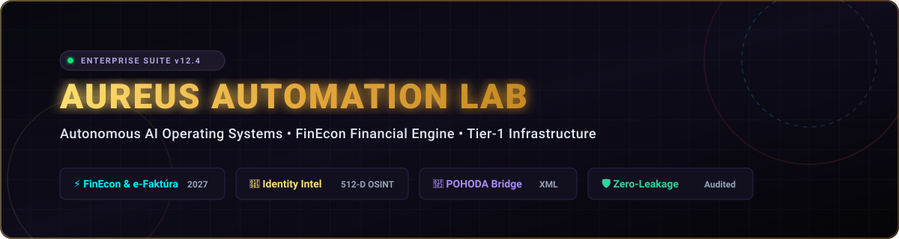
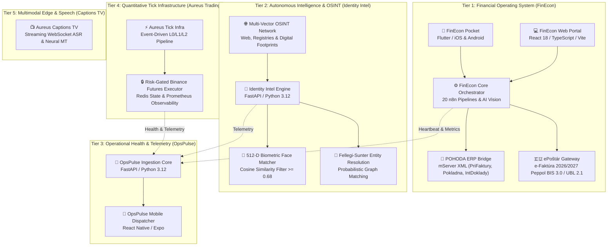
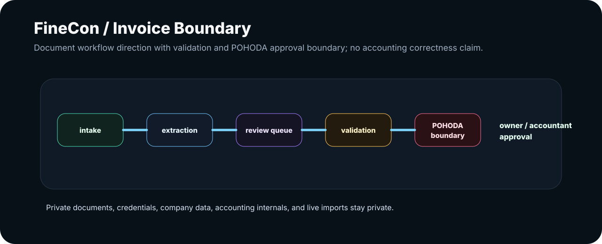
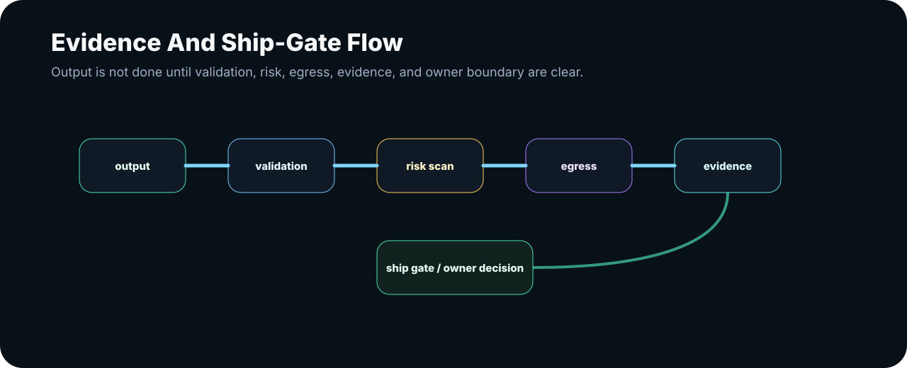
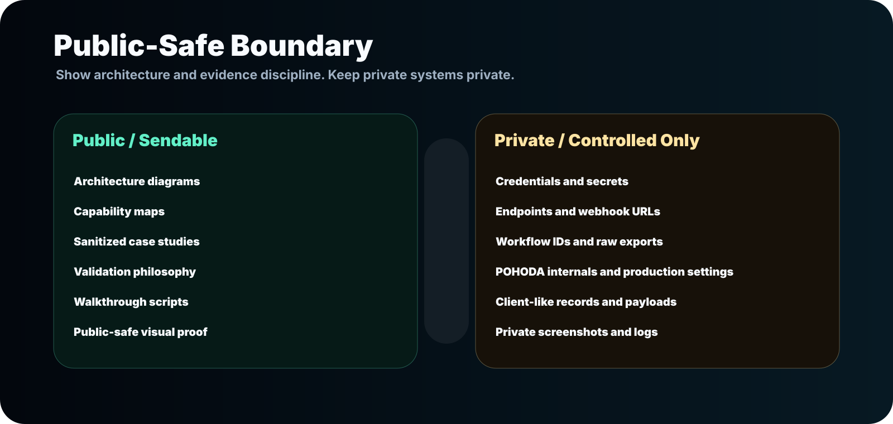

<div align="center">



<br/>

<p align="center">
  <a href="https://github.com/Aureus-Automation-Lab"></a>
  <a href="https://github.com/AureusAutomationLab"></a>
  <a href="docs/products/public-boundary.md"></a>
  <a href="https://aureus.it.com/automationlab"></a>
</p>

<p align="center">
  <strong>The Autonomous Enterprise Operating System connecting physical field intake, AI extraction, POHODA ERP ledgers, and European e-Invoicing.</strong>
</p>

<p align="center">
  Architected & Engineered by <strong>Róbert Kolesár</strong> &amp; <strong>Patrik Trnavský</strong>
</p>

---

[ ⚡ Executive Summary ](#-executive-summary--the-5-second-verdict) • 
[ 📊 Architecture ](#-master-5-tier-architecture) • 
[ 🍱 Bento Grid Ecosystem ](#-the-aureus-bento-grid-suite) • 
[ ⚖️ The Comparison Matrix ](#-why-aureus-beats-traditional-automation) • 
[ 🔍 Deep-Dive Contracts ](#-interactive-architecture--data-contracts) • 
[ 🛡️ Proof Showroom ](#-public-proof-showroom--tamper-evident-evidence) • 
[ 🚀 Commercial Engagement ](#-commercial-pilots--engagement)

---

</div>

## ⚡ Executive Summary – The 5-Second Verdict

Aureus Automation Lab solves the single most expensive bottleneck in modern operations: **the gap between messy real-world inputs and strict, legally compliant accounting & operational databases.**

```text
┌─────────────────────────┐       ┌─────────────────────────┐       ┌─────────────────────────┐
│     1. AI PREPARES      │  ──►  │    2. HUMANS APPROVE    │  ──►  │    3. SYSTEMS PROVE     │
│ OCR, Parse, Categorize  │       │ 1-Tap Review on Mobile  │       │ SHA-256 Ledger & POHODA │
└─────────────────────────┘       └─────────────────────────┘       └─────────────────────────┘
```

* **Zero Retyping:** Eliminates 80%+ of manual document entry for accounting firms and enterprises.
* **Deterministic Accounting:** Slovak & CEE tax intelligence (predkontácie `518`/`501`/`602`/`604`, EU reverse-charge `aInt`/`bInt`, and fuel `50:50`/`80:20` splits).
* **e-Faktúra 2026/2027 Ready:** Turnkey Peppol BIS 3.0 / UBL 2.1 ePoštár gateway with HMAC-SHA256 authenticated webhook ingress.
* **Zero-Leakage Guarantee:** Hardware-isolated credentials; zero private keys or client data in source control.

---

## 🗺️ Master 5-Tier Architecture



---

## 🍱 The Aureus Bento Grid Suite

<table width="100%">
  <tr>
    <td width="50%" valign="top">
      <h3>💼 FinEcon Ecosystem</h3>
      <p><em>The flagship financial operating system connecting mobile field intake, Slovak tax intelligence, and ERP ledgers.</em></p>
      <ul>
        <li><strong>Pocket App:</strong> Offline-first Flutter client (iOS/Android) with 1-tap review and draft restore.</li>
        <li><strong>Accounting Logic:</strong> Automated pre-accounting (<code>518</code>, <code>501</code>, <code>602</code>, <code>604</code>, reverse-charge <code>aInt</code>/<code>bInt</code>).</li>
        <li><strong>POHODA Bridge:</strong> Native XML schemas (<code>PriFaktury</code>, <code>VydFaktury</code>, <code>Pokladna</code>).</li>
        <li><strong>e-Faktúra 2026/2027:</strong> Peppol BIS 3.0 &amp; ePoštár gateway.</li>
      </ul>
      <p>
        <a href="https://github.com/AureusAutomationLab/FinEcon"></a>
        <a href="https://github.com/AureusAutomationLab/n8n-workflows"></a>
      </p>
    </td>
    <td width="50%" valign="top">
      <h3>🦅 Aureus Identity Intel</h3>
      <p><em>Tier-1 Autonomous OSINT, Biometric Fusion &amp; Entity Resolution Intelligence Platform.</em></p>
      <ul>
        <li><strong>Multi-Vector Recon:</strong> Correlates web footprints, public registries, emails, and phone numbers.</li>
        <li><strong>512-D Face Biometrics:</strong> Vector embeddings with Cosine similarity filtering ($\ge 0.68$).</li>
        <li><strong>Fellegi-Sunter Model:</strong> Mathematical entity resolution eliminating homonyms.</li>
        <li><strong>Graph Topology:</strong> NetworkX knowledge graph with Neo4j/Memgraph exports.</li>
      </ul>
      <p>
        <a href="https://github.com/AureusAutomationLab/aureus-identity-intel"></a>
        <a href="https://github.com/AureusAutomationLab/aureus-identity-intel"></a>
      </p>
    </td>
  </tr>
  <tr>
    <td width="50%" valign="top">
      <h3>📡 OpsPulse Telemetry</h3>
      <p><em>Centralized microservice health aggregation, latency tracking, and proactive alerting.</em></p>
      <ul>
        <li><strong>High-Throughput Ingestion:</strong> FastAPI core collecting real-time heartbeats across all nodes.</li>
        <li><strong>Mobile Monitor:</strong> React Native / Expo app for executive operations tracking.</li>
        <li><strong>Instant Alerting:</strong> Multi-channel Telegram dispatcher for anomaly and error spikes.</li>
      </ul>
      <p>
        <a href="https://github.com/AureusAutomationLab/opspulse"></a>
      </p>
    </td>
    <td width="50%" valign="top">
      <h3>📈 Aureus Trading Infra</h3>
      <p><em>Deterministic event-driven crypto scalping infrastructure with strict risk boundaries.</em></p>
      <ul>
        <li><strong>L0/L1/L2 Event Pipeline:</strong> Ultra-fast tick normalization and order book telemetry.</li>
        <li><strong>Hardware-Isolated Executor:</strong> Dedicated daemon holding Binance API credentials.</li>
        <li><strong>Observability:</strong> Prometheus exporter paired with Grafana production dashboards.</li>
      </ul>
      <p>
        <a href="https://github.com/AureusAutomationLab/aureus-trading"></a>
      </p>
    </td>
  </tr>
</table>

---

## ⚖️ Why Aureus Beats Traditional Automation

| Feature / Dimension | Legacy Manual Process | Generic Zapier / Make | 🏛️ Aureus Autonomous Stack |
| :--- | :---: | :---: | :---: |
| **Slovak Tax & Pre-Accounting** | ❌ Manual typing | ❌ Basic text only | 🟢 **Native (518, 501, reverse-charge, fuel splits)** |
| **POHODA ERP Integration** | ❌ Tedious CSV/Hand-entry | ❌ None | 🟢 **Direct mServer XML (`PriFaktury`, `Pokladna`)** |
| **e-Faktúra 2026/2027 Compliance**| ❌ Unknown risk | ❌ Not supported | 🟢 **Turnkey Peppol BIS 3.0 / ePoštár Gateway** |
| **Field Mobile Intake** | ❌ Lost receipts in cars | ❌ Clunky web forms | 🟢 **FinEcon Pocket Flutter App (Offline + Drafts)** |
| **Human-in-the-Loop Governance** | ❌ Subject to fatigue | ❌ "Blind" unattended run | 🟢 **Gated dry-run preflights + 1-Tap Review UI** |
| **Audit Trail & Proof Packs** | ❌ Missing paper | ❌ Ephemeral logs | 🟢 **Cryptographic SHA-256 State Proof Packs** |
| **Credential Security** | ❌ Shared passwords | ❌ Exposed in cloud steps | 🟢 **Isolated hardware/OS-level secret storage** |

---

## 🔍 Interactive Architecture & Data Contracts

<details>
<summary><strong>🔍 Click to inspect FinEcon ➔ POHODA mServer XML Data Contract</strong></summary>

```xml
<?xml version="1.0" encoding="utf-8"?>
<dat:dataPack xmlns:dat="http://www.stormware.cz/schema/version_2/data.xsd"
              xmlns:inv="http://www.stormware.cz/schema/version_2/invoice.xsd"
              version="2.0" id="AUREUS_FINECON_PACK_2026" ico="12345678" application="FinEcon">
  <dat:dataPackItem id="26110001" version="2.0">
    <inv:invoice version="2.0">
      <inv:invoiceHeader>
        <inv:invoiceType>receivedInvoice</inv:invoiceType>
        <inv:number><typ:numberRequested>26110001</typ:numberRequested></inv:number>
        <inv:symVar>20260012</inv:symVar>
        <inv:date>2026-05-29</inv:date>
        <inv:dateTax>2026-05-29</inv:dateTax>
        <inv:dateDue>2026-06-12</inv:dateDue>
        <inv:text>IT Consulting & Cloud Infrastructure Services</inv:text>
        <inv:accounting><typ:ids>518</typ:ids></inv:accounting>
        <inv:classificationVAT><typ:ids>DDsluz</typ:ids></inv:classificationVAT>
        <inv:partnerIdentity>
          <typ:address><typ:company>Tech Services s.r.o.</typ:company><typ:ico>98765432</typ:ico></typ:address>
        </inv:partnerIdentity>
      </inv:invoiceHeader>
    </inv:invoice>
  </dat:dataPackItem>
</dat:dataPack>
```
</details>

<details>
<summary><strong>🔍 Click to inspect ePoštár / Peppol BIS Billing 3.0 UBL 2.1 E-Invoicing Schema</strong></summary>

```json
{
  "mode": "production_gated",
  "source_workflow": "FinEcon_05_Accounting",
  "document_type": "invoice",
  "sender_participant_id": "0245:SK1234567890",
  "receiver_participant_id": "0245:SK9876543210",
  "metadata": {
    "documentId": "DOC_2026_0901_AUREUS",
    "documentTypeId": "urn:oasis:names:specification:ubl:schema:xsd:Invoice-2",
    "processId": "urn:fdc:peppol.eu:2017:poacc:billing:01:1.0",
    "creationDateTime": "2026-09-01T12:00:00Z"
  },
  "payloadFormat": "XML",
  "payloadEncoding": "UTF-8",
  "signature_gate": "VERIFIED_HMAC_SHA256"
}
```
</details>

<details>
<summary><strong>🔍 Click to inspect Identity Intel Biometric Fusion & Graph Resolution</strong></summary>

```python
# 512-Dimensional Biometric Verification Matrix (Cosine Similarity Threshold >= 0.68)
biometric_result = await face_matcher.verify(
    probe_embedding=probe_vector_512d,
    gallery_embedding=gallery_vector_512d,
    threshold=0.68
)

# Probabilistic Entity Resolution (Fellegi-Sunter Formulation)
resolution_weight = (
    weight_biometrics * biometric_result.similarity +
    weight_geo_proximity * geo_distance_km(loc_a, loc_b) +
    weight_semantics * tfidf_bio_match(bio_a, bio_b) +
    weight_alias * jaro_winkler(alias_a, alias_b)
)
is_verified_match = resolution_weight >= DECISION_THRESHOLD_ALPHA
```
</details>

---

## 🏛️ Public Proof Showroom – Tamper-Evident Evidence

Aureus systems operate under strict **non-repudiation and cryptographic auditability**. Every processed document batch produces a verifiable **Proof Pack** with SHA-256 state hashes:

<div align="center">

| Proof Category | Architectural Diagram | Description & Verification |
| :--- | :---: | :--- |
| **FinEcon Flow & POHODA Gateway** |  | Gated transition from raw mobile capture to verified POHODA mServer XML. |
| **Audit Ledger & Proof Hash** |  | Tamper-evident event ledger storing SHA-256 byte signatures for legal compliance. |
| **Aureus Operating Boundary** |  | Strict boundary ensuring zero private credentials or customer data in public space. |

[👉 Explore the Complete Public Proof Showroom](public-proof/README.md)

</div>

---

## 💼 Commercial Pilots & Engagement

We partner with **accounting bureaus, field-intensive enterprises, and growing SMEs** to implement end-to-end automation with guaranteed ROI:

* 🏢 **FinEcon Pilot Program:** Turnkey deployment of FinEcon Pocket for your field staff + POHODA mServer automated pre-accounting bridge.
* 🔍 **Automation Audit (Process Discovery):** Detailed mapping of manual bottlenecks, ROI modeling, and a phased automation blueprint.
* 🤝 **Monthly Automation Partner Retainer:** Continuous pipeline engineering, 24/7 OpsPulse monitoring, and dedicated infrastructure support.

---

<div align="center">

### 🚀 Ready to Automate Your Business Operations?

[](https://aureus.it.com/automationlab)
[](https://linkedin.com)
[](mailto:kimi.aoki.if@gmail.com)

<br/>

<sub>© 2026 Aureus Automation Lab. Engineered for Autonomous Reliability & Enterprise Excellence.</sub>

</div>
