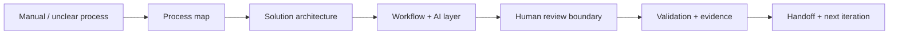

# Robert Kolesar / KimiAoki

**AI Automation Solution Architect**

I design AI-assisted workflow systems, internal tools, and product slices that turn manual business processes into controlled, reviewable, and maintainable systems.

My work starts with the business process, then moves through solution architecture, workflow and AI layers, validation, evidence, documentation, and handoff.

This profile is a public-safe front door: it shows how I think and what I can build without exposing private systems, workflow exports, credentials, endpoints, or production context.

## At A Glance

| Signal | Meaning |
| --- | --- |
| Role | AI Automation Solution Architect |
| Core strength | Turning manual processes into controlled AI-assisted workflow systems |
| Best fit | AI automation, internal tools, workflow orchestration, product slices |
| Delivery style | First useful scope, validation-first delivery, evidence, handoff |
| Public boundary | Architecture and process shown; private implementation stays private |

## Review Path

| If you are... | Start here | What you will see |
| --- | --- | --- |
| Recruiter / hiring manager | Best-Fit Roles, Tools And Stack, Review Guide | Role fit, stack, positioning, review path |
| Technical reviewer | Solution Architecture, Case Studies, Capabilities | Architecture layers, validation, boundaries |
| Client / partner | What I Build, Build Menu, Collaboration | Project formats, workflow approach, handoff |

## Public Architecture Snapshot

## Core Signal

I am strongest at:

- turning unclear processes into structured workflow systems,
- separating safe automation from human-reviewed decisions,
- designing AI layers with validation instead of blind trust,
- creating first useful product slices,
- documenting handoff so the system can be operated later.

## What I Build

| System type | What it turns into |
| --- | --- |
| Manual process | Controlled workflow |
| Scattered documents | Structured review flow |
| AI idea | AI-assisted workflow with boundaries |
| Internal operation | Dashboard / operating console |
| Product idea | First useful product slice |
| Fragile automation | Reviewable, documented system |

| Output | Why it matters |
| --- | --- |
| Process map | Makes ownership and handoffs visible |
| Architecture snapshot | Shows data, workflow, AI, and review boundaries |
| Validation checklist | Makes output quality reviewable |
| Evidence notes | Shows what happened and why |
| Handoff notes | Makes the system operable later |
| Next-step roadmap | Keeps iteration grounded in proof |

## Architecture Cards

| Card | Signal |
| --- | --- |
| Process first | I start with the business process, owner, decision, and failure points |
| AI with boundaries | AI suggests, classifies, drafts, or structures; humans approve sensitive actions |
| Validation-first | Output is not done until it has tests, examples, review states, or evidence |
| Handoff-ready | A system should be understandable after the builder leaves |

## Proof Without Exposure

Most serious automation work cannot be shown as raw code because it may contain private workflow logic, credentials, endpoints, documents, or business data. Instead, this profile shows:

- architecture patterns,
- public-safe case study directions,
- capability maps,
- validation philosophy,
- collaboration and handoff model,
- controlled review boundaries.

## Review In 60 Seconds

1. Read the hero and At A Glance.
2. Check the Architecture Snapshot.
3. Review Best-Fit Roles and Tools And Stack.
4. Open [CASE_STUDIES.md](CASE_STUDIES.md) for public-safe examples.
5. Open [SOLUTION_ARCHITECTURE.md](SOLUTION_ARCHITECTURE.md) for architecture depth.

## Best-Fit Roles

- AI Automation Solution Architect
- AI Automation Engineer
- AI Product Engineer
- Solution Architect, AI Automation
- Workflow Automation Specialist
- Internal Tools Engineer
- Product Operations Engineer
- Solutions Engineer, AI Automation
- Agentic Workflow Engineer

## Tools And Stack

| Area | Tools and patterns |
| --- | --- |
| AI / LLMs | OpenAI models, prompt design, RAG patterns, AI-assisted workflows, evaluation checklists |
| Workflow automation | n8n-style orchestration, routing, approvals, retries, status flows, review states |
| Engineering delivery | GitHub, Codex-style workflows, PR discipline, validation-first delivery, documentation |
| Backend/services | Python, FastAPI basics, APIs, JSON/XML, service boundaries |
| Frontend/product surfaces | React/TypeScript, dashboards, product demos, landing pages, internal tools |
| Business systems | Google Workspace, Gmail, Drive, Sheets, Telegram, document workflows |
| Quality/operations | Test cases, proof packs, audit notes, health checks, privacy boundaries, handoff docs |

## What I Do Not Claim

This profile does not claim customer outcomes, production deployments, accounting correctness, trading performance, enterprise compliance, or revenue unless separately verified. Finance, POHODA, trading, and live automation topics are presented only as bounded workstreams or public-safe architecture directions.

## Current Portfolio Status

| Area | Public posture |
| --- | --- |
| GitHub profile | Public-safe front door |
| Case studies | Sanitized architecture directions |
| Private repositories | Not exposed by default |
| Technical walkthroughs | Available with controlled scope |
| Production/client-like material | Not public |

## Portfolio Navigation

| Page | Use it for |
| --- | --- |
| [SOLUTION_ARCHITECTURE.md](SOLUTION_ARCHITECTURE.md) | Architecture layers, decision boundaries, validation thinking |
| [CASE_STUDIES.md](CASE_STUDIES.md) | Public-safe project directions |
| [CAPABILITIES.md](CAPABILITIES.md) | What I can design, build, validate, and hand off |
| [BUILD_MENU.md](BUILD_MENU.md) | Collaboration and project formats |
| [COLLABORATION.md](COLLABORATION.md) | How work starts, moves, and hands off |
| [PUBLIC_BOUNDARY.md](PUBLIC_BOUNDARY.md) | What can and cannot be shown publicly |
| [REVIEW_GUIDE.md](REVIEW_GUIDE.md) | How recruiters, reviewers, and partners should read this profile |
| [PROFILE_COMPLETENESS_CHECK.md](PROFILE_COMPLETENESS_CHECK.md) | Public-readiness checklist |
| [PROFILE_PINS_GUIDE.md](PROFILE_PINS_GUIDE.md) | Manual GitHub profile pin guidance |
| [VISUAL_REVIEW.md](VISUAL_REVIEW.md) | Visual and diagram review index |

## Technical Walkthrough

I can walk through selected architecture notes, sanitized examples, and public-safe workflow shapes after the initial context and privacy boundary are clear.
