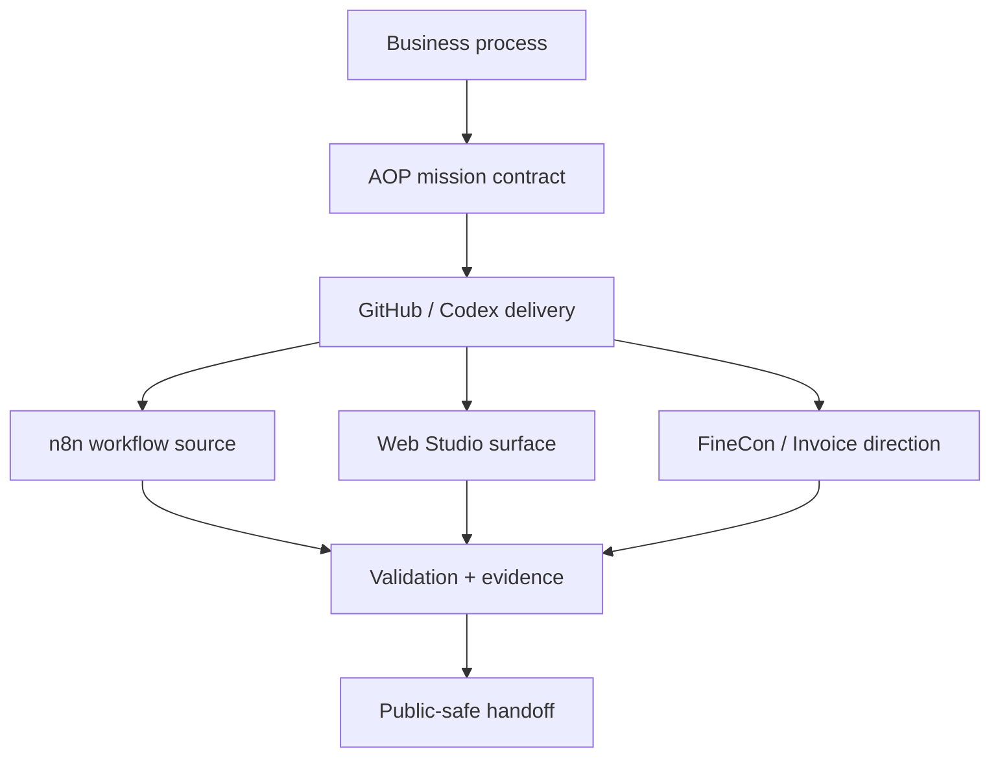
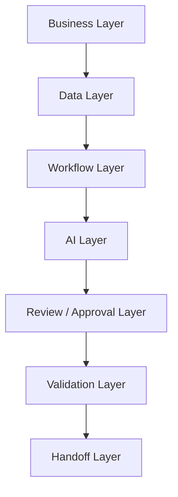

# Solution Architecture


Public-safe concept visual. Not a screenshot, not customer proof, not production evidence.

| Page signal | What this page demonstrates |
| --- | --- |
| Architecture lens | business process -> AOP layers -> review boundaries -> validation -> handoff |
| Best proof | layer snapshot, decision matrix, failure modes, artifacts |
| Safety boundary | architecture without credentials, private endpoints, POHODA internals, or live system details |

## Aureus AOP Architecture Lens

This profile now represents Robert Kolesár / KimiAoki as Founder of Aureus Automation Lab, AI Product Systems Architect, and builder of Aureus Autonomous Operating Platform.

Aureus AOP connects business process discovery, n8n workflow automation, GitHub / Codex delivery, Azure/OpenAI Supervisor capability, validation, egress review, evidence, Web Studio / Experience surfaces, and FineCon / Invoice workflow direction.



## AOP Layer Snapshot

| Layer | Purpose | Public-safe artifact |
| --- | --- | --- |
| Business process | Understand owner, inputs, decisions, failures, and handoffs | Process map |
| GitHub delivery | Make work scoped, reviewed, and evidence-backed | PR / review path |
| n8n workflow | Treat automation as reviewable source | Workflow boundary map |
| AI / Supervisor | Use AI assistance with verifier and evidence concepts | Supervisor capability note |
| Validation | Prove output quality before trust | Checklist / proof pack |
| Egress review | Keep external output safe | Public-safe release note |
| Handoff | Make operation understandable later | Operating notes |

## Architecture Snapshot



## Layer Snapshot

| Layer | Purpose | Output |
| --- | --- | --- |
| Business | Understand process, owner, and outcome | Process map |
| Data | Define input, structure, sensitivity | Data boundary |
| Workflow | Define states, routing, retries, exceptions | Workflow map |
| AI | Define where AI assists | AI role brief |
| Review | Define approval and human ownership | Review boundary |
| Validation | Define proof and tests | Validation checklist |
| Handoff | Make operation clear | Operating notes |

## Decision Boundary Matrix

| Boundary | Question | Output |
| --- | --- | --- |
| Automation | What can run without review? | Safe workflow action |
| AI suggestion | What can AI draft or classify? | Structured suggestion |
| Human approval | What needs owner decision? | Review state |
| Stop condition | What blocks the workflow? | Error / exception state |
| Evidence | What must be logged? | Proof note |
| Fallback | What happens when uncertain? | Manual path |

## Solution Architecture Philosophy

I start with the business process before choosing tools. The most important question is not "what can be automated?" but "what outcome needs to become clearer, faster, safer, or easier to operate?"

Good AI automation architecture defines ownership, separates automation from human review, makes outputs testable, builds small first, and documents how the system should be operated after handoff.

The aim is a controlled workflow system: clear inputs, clear decisions, clear review states, clear evidence, and a practical next-step roadmap.

## Architecture Flow

```text
Business process
-> process discovery
-> scope definition
-> data boundary
-> tool boundary
-> workflow architecture
-> AI layer
-> review / approval layer
-> validation layer
-> evidence / logs
-> handoff
-> iteration roadmap
```

## Architecture Layers

| Layer | Purpose | Key questions | Public-safe artifact |
| --- | --- | --- | --- |
| Business layer | Understand the real process, owner, and outcome | What happens today? Who owns the decision? What breaks? | Process map and first-scope brief |
| Data layer | Define inputs, sensitivity, structure, and retention boundary | What data enters? What is private? What must be validated? | Sample schema and privacy notes |
| Workflow layer | Shape routing, states, retries, exceptions, and handoffs | What happens next? What can fail? What needs a fallback? | Workflow state map |
| AI layer | Define where AI assists without becoming uncontrolled authority | What may AI suggest? What confidence or review state is needed? | AI role brief and eval checklist |
| Review/approval layer | Keep important decisions owned by humans | Who approves? What blocks downstream action? | Approval boundary and review queue shape |
| Validation layer | Prove outputs are structured, reviewable, and safe enough to use | What tests exist? What evidence is captured? | Test examples and proof checklist |
| Handoff layer | Make the system understandable after the build | Who operates it? What are known limits? What comes next? | Operating notes and next-step backlog |

## Design Questions

- What is the current manual process?
- What tools are involved?
- Who owns the result?
- What breaks, slows down, or depends on memory?
- What decision requires a human?
- What data is sensitive?
- What does "correct" mean in this workflow?
- How do we test output?
- What happens when AI confidence is low?
- What needs approval before a downstream action?
- What should be logged or captured as evidence?
- What is the rollback or manual fallback?
- What should the first useful version prove?
- Who needs to operate the system after handoff?
- What is the next iteration if the first slice works?

## Decision Boundaries

A serious workflow should make these boundaries explicit:

- what the system may automate,
- what AI may suggest,
- what a human must approve,
- what must be logged,
- what must stop the workflow,
- what requires a manual fallback.

## AI Layer Design

AI should assist the workflow, not become an uncontrolled operator. Safer patterns include:

- AI as assistant, not final authority,
- structured inputs and outputs,
- confidence or review states,
- source-grounded summaries when needed,
- no blind trust in model output,
- evaluation checklists,
- escalation rules for low-confidence, sensitive, or incomplete cases.

## Failure Modes I Design For

- missing or incomplete input,
- low-confidence AI output,
- schema mismatch,
- duplicate record,
- unclear owner,
- unsafe downstream action,
- hidden dependency,
- unreviewed live action,
- private-data exposure risk.

## Validation-First Delivery

Model output is not complete by default. A useful AI-assisted workflow needs validation around the work:

- realistic test examples,
- expected output checks,
- exception states,
- logs or evidence capture,
- review states,
- proof pack,
- approval boundary,
- handoff notes.

Validation-first delivery keeps the system honest. It gives the owner a way to review what happened, catch edge cases, and decide whether the next iteration is worth building.

## Architecture Artifacts

A serious project should produce the right artifacts for its size and risk:

- process map,
- architecture diagram,
- data flow,
- integration map,
- risk register,
- acceptance criteria,
- test examples,
- handoff notes,
- next-step backlog.

## Public-Safe Review

Public technical walkthroughs can safely show:

- diagrams,
- sanitized screenshots,
- public-safe case study,
- sample workflow shape,
- documentation structure,
- validation and handoff approach.

Private material stays private:

- credentials,
- raw exports,
- endpoints,
- private logic,
- client-like data,
- production settings.
