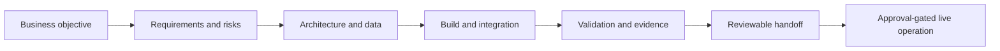

# Aureus Project Map

This map separates the four principal Aureus engineering tracks while showing the operating discipline they share.

## Shared Delivery Spine



**Aureus OS** provides the shared delivery spine. It is not a fifth product competing with the other systems and it is not a replacement for their domain logic.

## Portfolio Architecture

| System | Primary domain | Strongest public signal | Current public boundary |
| --- | --- | --- | --- |
| **Aureus OS** | AI-assisted company execution | Mission control, agent/tool routing, validation, evidence, and explicit action authority | Public architecture; private runtime and live controls remain private |
| **Aureus CRM Operations** | Business operations | Full-stack UI/API/database delivery with roles, state transitions, inventory, tasks, attendance, calendar, and audit | Source-backed synthetic proof; no real customer data or live integrations |
| **Aureus FinEcon** | Document and finance operations | Reviewed intake, extraction, bridge handoff, proof notes, and accountant boundary | Pilot direction; no accounting or tax correctness claim |
| **Aureus Trading Infrastructure** | Risk-sensitive event processing | Deterministic rails, isolated executor, runtime state, observability, CI, rollback, and paper-run discipline | Architecture proof only; no live-return or financial-advice claim |

## What The Combination Proves

Together, the systems show an ability to move through the complete product chain:

```text
business requirements
→ domain model
→ backend and data state
→ user experience or automation
→ AI assistance where justified
→ audit and observability
→ tests and release controls
→ operational handoff
```

The systems remain independently reviewable. A claim about one pillar does not automatically transfer to another.

## Review Links

- [Aureus OS](../../public-proof/aureus-os/README.md)
- [Aureus CRM Operations](../../public-proof/crm-platform/README.md)
- [Aureus FinEcon](../../public-proof/finecon/README.md)
- [Aureus Trading Infrastructure](../../public-proof/trading-infrastructure/README.md)
- [Canonical public naming system](naming-system.md)
- [Claim-to-source map](../proof/source-truth-map.md)
