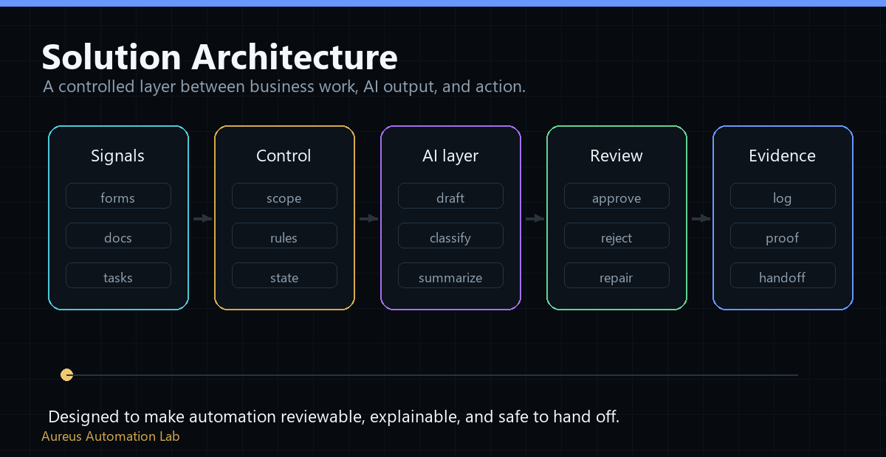

# Solution Architecture



## Architecture Summary

Aureus Automation Lab designs controlled AI automation systems around one pattern:

```text
Business Signal
-> Mission Queue
-> AI Workflow Layer
-> Human Review
-> Evidence Ledger
-> Business Output
```

The architecture is intentionally simple for the public profile. Private implementation details stay private.

## Core Layers

| Layer | Purpose | Public-safe signal |
| --- | --- | --- |
| Business Signal | Capture the real process trigger | email, document, lead, request, report, task |
| Mission Queue | Turn messy work into a scoped mission | owner, goal, constraints, next step |
| AI Workflow Layer | Let AI prepare work, not blindly finalize it | draft, classify, extract, summarize, check |
| Human Review | Keep important actions approved by people | approval queue, exception review, decision point |
| Evidence Ledger | Preserve what happened | notes, state, validation result, handoff proof |
| Business Output | Produce the useful next step | proposal, reviewed queue, report, follow-up, handoff |

## What AOP Means Here

AOP / Aureus OS is the internal operating engine. It is not the first product sold to clients.

It is the delivery discipline behind the work:

- scope before automation,
- review before risky action,
- validation before handoff,
- evidence before claims,
- public/private boundary before sharing.

## Design Principle

The architecture does not ask a company to trust AI as final authority.

It asks:

```text
What can AI prepare?
What must a person approve?
What proof should remain?
What business output should happen next?
```

## What Stays Private

This page does not expose workflow exports, credentials, endpoints, webhook URLs, private prompts, customer-like data, production logs, or live system details.

For deeper public-safe docs, see [solution architecture detail](../system/solution-architecture.md).
