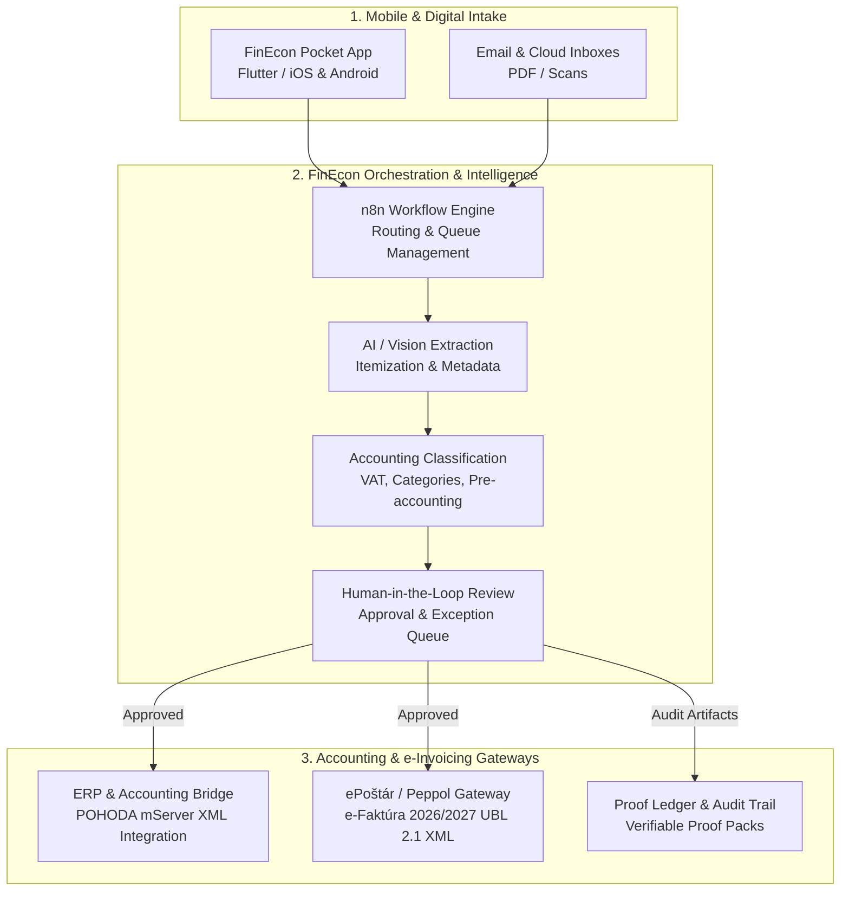

# FinEcon Ecosystem

**A controlled financial workflow operating system connecting mobile intake, AI extraction, accounting orchestration, and electronic invoicing.**

FinEcon is designed for accounting firms, growing enterprises, and field-intensive businesses that need end-to-end visibility, reduced manual overhead, and strict human-in-the-loop control over their financial document flow.

---

## The Three Core Pillars

FinEcon is an integrated ecosystem comprised of three synergistic layers:

---

## 1. FinEcon Core (Orchestration & Accounting Bridge)

FinEcon Core is the central orchestration backbone built on structured workflow pipelines. It manages the entire lifecycle of financial documents from initial discovery to final ledger write-back.

### Key Capabilities:
* **Multi-Tenant Company Routing:** Resolves incoming documents dynamically by company code, fiscal year, and document series.
* **Intelligent Document Parsing:** Extracts supplier/customer data, document numbers, variable symbols, tax dates, net/VAT/gross amounts, and line items.
* **Advanced Accounting Logic (Slovak & CEE Standards):**
  * Automated pre-accounting classification (`518`, `501`, `602`, `604`, `511`, etc.).
  * Reverse-charge and self-taxation workflows for EU services and goods (internal documents `aInt`/`bInt`, VAT classifications).
  * Vehicle and fuel expense apportionment (e.g., 50:50 or 80:20 statutory rules).
* **Controlled ERP Integration (POHODA mServer):**
  * Automated XML generation compliant with standard ERP schemas (`PriFaktury.xml`, `VydFaktury.xml`, `Pokladna.xml`, `IntDoklady.xml`).
  * Gated execution: dry-run preflight checks, connection verification, and explicit review gates before committing records to the accounting ledger.
* **Cryptographic Proof Packs:** Generates tamper-evident audit packages with payload hashes (SHA-256) and complete state transition histories.

---

## 2. FinEcon Pocket (Mobile Client)

**FinEcon Pocket** is a cross-platform mobile client (Flutter / iOS & Android) engineered for fast, frictionless capture at the point of expense.

### Key Features:
* **Rapid Document Capture:** Instant camera scanning and PDF intake with document edge detection and metadata tagging.
* **Draft Persistence & Offline Queue:** Local draft auto-recovery and deterministic retry queues ensure zero lost documents during network dropouts.
* **Self-Service Tenant Onboarding:** Frictionless company setup with automated directory provisioning and routing initialization.
* **Mobile Review & Approval Interface:** Managers and accountants can review extracted document fields, approve transactions, flag exceptions (`needs_fix`), or reject invalid submissions directly on mobile.
* **Dashboard & Due-Date Reminders:** Real-time visibility into monthly expense snapshots, cashflow trends, and upcoming invoice due dates.
* **Enterprise Security:** Biometric authentication (FaceID/Fingerprint), hardware-backed secure token storage (`flutter_secure_storage`), and complete Slovak (`sk`) and English (`en`) localization.

---

## 3. ePoštár Gateway (e-Faktúra 2026/2027 & Peppol)

The **ePoštár Gateway** layer prepares businesses for mandatory European and Slovak B2B/B2G electronic invoicing regulations.

### Key Features:
* **Standardized UBL 2.1 / Peppol BIS Billing 3.0:** Converts approved invoice data into legally compliant, validated electronic invoice XML structures according to national technical guidelines (SK TDD).
* **Bi-Directional E-Invoicing:**
  * **Outbound Transmission:** Automated dispatch of structured e-invoices to recipient Access Points via the ePoštár API.
  * **Inbound Push Ingress:** Secure webhook endpoints protected by **HMAC-SHA256** signatures (`X-Webhook-Signature`, timestamp tolerance verification, and replay protection).
  * **Pull Queue Worker:** Resilient fallback queue consumer with explicit message acknowledgment (`ACK`) mechanics.
* **Direct Handover to Accounting:** Inbound structured electronic invoices bypass OCR entirely, feeding directly into validation and pre-accounting workflows.

---

## Who FinEcon is Built For

| Target Audience | Primary Pain Points Solved | Key Business Value |
| :--- | :--- | :--- |
| **Accounting Offices & Bureaus** | End-of-month document bottlenecks, manual typing into ERP, chasing missing receipts. | Increases capacity per accountant by 3x–5x; eliminates manual typing while maintaining 100% review control. |
| **Field-Heavy Enterprises** *(Construction, Logistics, Installation)* | Receipts lost in vehicles, delayed expense reporting, messy cash registers. | Documents captured in 5 seconds at the point of sale; instant classification of fuel and materials. |
| **SMEs & Growing Companies** | Lack of real-time cashflow visibility, surprise tax obligations, disorganised document archives. | Transparent approval workflows, automated due-date reminders, and structured document storage. |
| **Forward-Looking Businesses** | Impending mandatory e-invoicing compliance (2026/2027). | Turnkey compliance with Peppol and national e-invoicing networks without disruptive ERP overhauls. |

---

## System Governance & Security Boundaries

FinEcon is built on the principle of **Appropriate Excellence** and strict risk containment:

1. **Human-in-the-Loop:** AI and automation prepare data and propose classifications; certified professionals retain full review authority before official ledger commitment.
2. **Zero Unattended Mutation:** High-consequence actions (tax filings, ledger commits, deletions) are protected by explicit authorization gates.
3. **Defense in Depth:** Zero hardcoded secrets in repositories; credentials reside exclusively in isolated credential managers and secure server environments.
4. **Audit Trail:** Every state change, extraction, and writeback is permanently recorded with full auditability.
