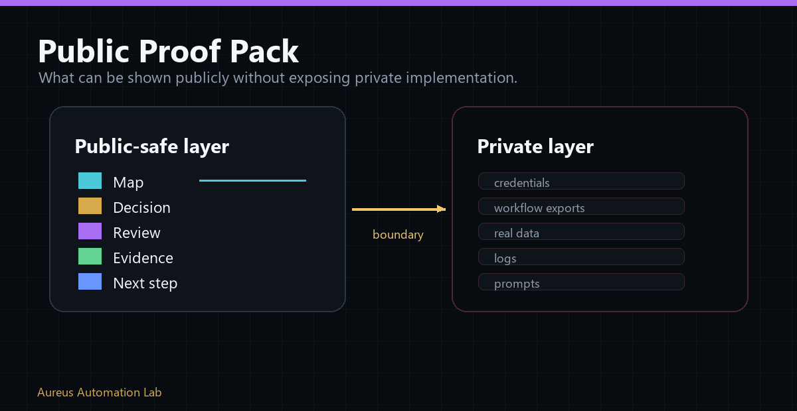

# Profile And Organization Pins Guide

Pins are a review path, not an inventory. Use [Pinned Items Strategy](pinned-items-strategy.md) for the target story and [Public Pin Candidates](public-pin-candidates.md) for current candidates.

## Rules

- pin only public repositories that pass the standalone promotion gate;
- prefer four strong proofs over six mixed or unfinished items;
- do not pin private repositories for public reviewers;
- do not pin an empty placeholder, copied documentation dump, stale experiment, or artifact that needs private context;
- make every pin's README explain purpose, artifact type, maturity, limitations, validation, and next path;
- use a meaningful architecture visual or sanitized product proof when it helps understanding;
- keep founder-profile and organization pins aligned to the same canonical portfolio manifest;
- record each pin change as an approved live GitHub mutation and verify it signed-out.

The strongest first pin is Aureus CRM Operations because a non-technical reviewer can understand customers, tasks, inventory, quotes, roles, audit, backend state, testing, and deployment boundaries without first learning internal Aureus terminology.
