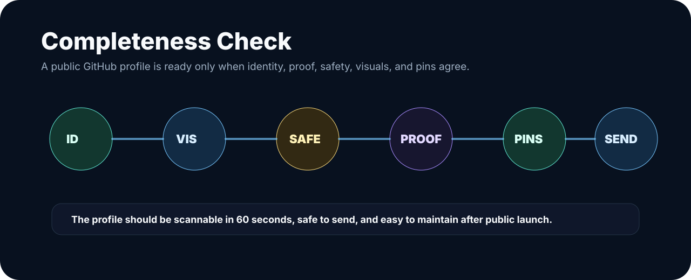

# Profile Readiness Check

This file is the public-readiness checklist for the `robertkolesar/robertkolesar` profile repository. It exists so future updates stay useful, honest, and safe for external viewers.

## Current State

| Area | Status | Notes |
| --- | --- | --- |
| Identity | Ready | Róbert Kolesár / robertkolesar, Founder of Aureus Automation Lab |
| Identity transition | Manual owner gate | Use `docs/profile/github-identity-transition.md` before changing GitHub username or repository name |
| Positioning | Ready | AI Product Systems Architect and builder of Aureus Autonomous Operating Platform |
| Public story | Ready | README explains what Aureus builds in plain language and technical review language |
| Automation Lab page | Ready | Public explanation exists in `docs/services/automation-lab.md` |
| FinEcon page | Ready | Public explanation exists in `docs/services/finecon.md` |
| Aureus OS page | Ready | Public explanation exists in `docs/system/aureus-os.md` |
| Proof boundary | Ready | `docs/proof/public-boundary.md`, `docs/proof/proof-index.md`, and `docs/proof/source-truth-map.md` explain what is and is not claimed |
| Git-backed truth | Ready | Public claims are mapped to private Aureus source artifact families without exposing private implementation |
| Public proof pages | Ready | Sales Machine, FinEcon, and Aureus OS proof pages exist as public-safe summaries |
| Release audit | Ready | `scripts/public_profile_audit.ps1` runs local checks before public launch |
| Visuals | Ready | Public-safe hero, architecture, workflow, and review visuals are included |
| Links | Validated locally | Internal Markdown links should be checked before each public push |
| Repository visibility | Manual owner gate | Make public only after owner confirms the final visibility change |
| Public pins | Manual follow-up | Pin only public-safe repos or gists after the profile repo is public |

## Public-Safe Boundary

The repository must not include:

- credentials or secrets,
- webhook URLs or private endpoints,
- private workflow exports,
- production logs,
- customer-like data,
- POHODA access details,
- private screenshots,
- unsupported customer, revenue, ROI, certification, accounting-correctness, or production-result claims.

## External Viewer Test

Before sharing the profile broadly:

1. Open the repository in a signed-out browser.
2. Confirm the README renders in the first screen.
3. Confirm images load.
4. Confirm internal links open.
5. Confirm public websites open.
6. Confirm private repositories are not required to understand the story.
7. Confirm the profile reads like a professional client-acquisition front door, not a private source dump.

## Maintenance Rule

Add new material only when it makes the public story clearer, safer, or more commercially useful. Do not add private implementation details just to make the profile look bigger.
