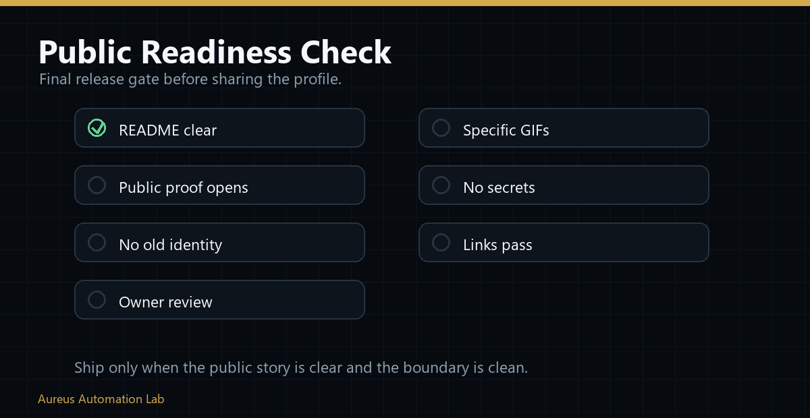

# Profile And Organization Readiness Check

## Current Evidence State

| Area | Status | Gate |
|---|---|---|
| Root profile story | `PASS` locally | Focused positioning, proof boundaries, and review paths |
| Canonical naming | `PASS` locally | One company, one Aureus OS, subordinate products and scenarios |
| Machine-readable portfolio | `PASS` locally | Manifest and policy validate together |
| Public governance | `APPROVAL_REQUIRED` | Distinct human review, protected merge, read-only attestation |
| License boundary | `APPROVAL_REQUIRED_LICENSE_DECISION` | No license grant until the owner decides code, documentation, asset, and trademark terms |
| Contact path | `BLOCKED_PENDING_CONTACT_PATH` | Contact path pending owner approval and verification |
| Public promotion | `BLOCKED` | Do not claim `PROMOTION_READY` until every required gate passes |

## Public-Safe Boundary

Do not publish credentials, private endpoints, raw private workflows, production logs, personal or client data, private screenshots, internal authorization topology, or unsupported customer, revenue, ROI, certification, accounting, security, trading, or production claims.

## External Viewer Test

After every approved public merge or profile change:

1. open the affected public surfaces signed out;
2. confirm identity, role, and evidence clarity;
3. confirm navigation, images, and diagrams render;
4. confirm maturity and limitation labels remain visible;
5. confirm no private source is needed to understand the public story;
6. confirm the owner-approved contact URL resolves safely;
7. capture evidence in the canonical mission artifact directory.

## Decision

The public repository is reviewable, but the full promotion gate is not complete. Status remains `REPAIR_REQUIRED + APPROVAL_REQUIRED + BLOCKED` until independent review, licensing, verified contact, and live attestation are satisfied. See the [readiness matrix](../portfolio/public-portfolio-scorecard.md) and [review packet](github-governance-approval-packet.md).
