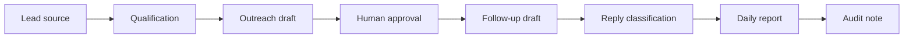

# Aureus Sales Workflow Public Proof

This page shows the public-safe direction of Aureus Sales Workflow.

It does not expose private workflow exports, credentials, endpoints, lead lists, inbox data, workflow IDs, draft IDs, or private prompts.

## Problem

Sales follow-up often breaks in small invisible ways:

- leads are captured but not qualified,
- good prospects wait too long,
- follow-ups depend on memory,
- replies are not classified,
- activity is hard to review,
- AI outreach becomes risky if it sends without approval.

The problem is not only speed. The problem is control.

## Safe Workflow Direction

```text
lead source
-> lead discovery / import
-> qualification
-> outreach draft
-> human approval
-> follow-up draft
-> reply classification
-> booking response draft
-> daily report
-> audit log
```

## What AI May Do

| AI role | Public-safe boundary |
| --- | --- |
| Lead qualifier | score or classify leads for review |
| Outreach assistant | draft first-message options |
| Follow-up assistant | draft follow-up options |
| Reply classifier | label replies and flag uncertainty |
| Reporting assistant | summarize activity and next actions |

## What Humans Approve

Humans approve:

- which leads are worth contacting,
- final outbound messages,
- sensitive replies,
- booking language,
- escalation decisions,
- any external send unless a separate controlled approval system exists.

## What This Proves Publicly

This proves the architecture direction: Aureus treats sales automation as a reviewed workflow, not as uncontrolled spam.

It shows:

- lead handling can be structured,
- AI can help without sending blindly,
- review boundaries can be explicit,
- daily reporting and audit notes can make the process visible.

## Example Public-Safe Workflow Map



## What Stays Private

Real lead lists, inbox data, message drafts, Gmail details, workflow IDs, credentials, endpoints, webhook URLs, private prompts, and private logs stay private.
