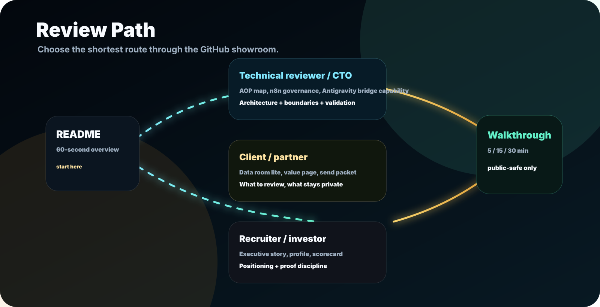
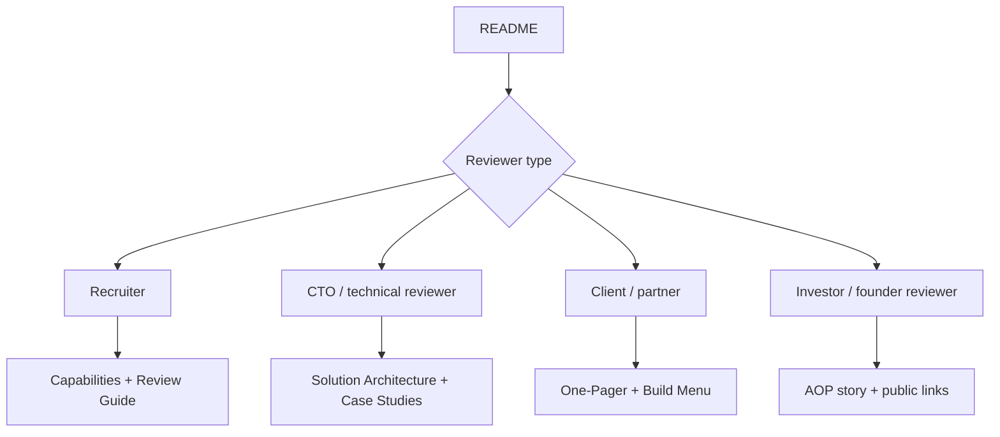

# Review Guide

| Page signal | What to do first |
| --- | --- |
| 60-second scan | README, At A Glance, Architecture Cards, Public Boundary |
| Technical scan | Solution Architecture, Case Studies, Capabilities |
| Client scan | One-Pager, Build Menu, Collaboration, public pages |

## 60-Second Review

If you only have 60 seconds:

1. Read the hero and At A Glance in [README.md](../../README.md).
2. Check the Public Architecture Snapshot.
3. Review [Capabilities](../services/capabilities.md) for role fit and system range.
4. Open [Case Studies](case-studies.md) for public-safe examples.
5. Check [Public Boundary](public-boundary.md) before asking for private material.

## Reviewer Journey

## For Recruiters

Adjacent role signals include AI automation architecture, AI product engineering, workflow automation, internal tools, product operations, solutions engineering, and agentic workflow design.

Start with the [root profile](../../README.md), then review [solution architecture](../system/solution-architecture.md) and [case studies](case-studies.md). Many real automation repositories and workflow exports stay private because they can contain business logic, credentials, customer-like data, endpoints, and production context.

## For Technical Reviewers

Look for solution architecture thinking rather than only source volume:

- business process first,
- validation-first delivery,
- workflow and data boundaries,
- human review states,
- public-safe case study directions,
- evidence, QA, and handoff discipline.

The useful signal is whether the system shape is controlled, reviewable, and maintainable.

## For Clients / Partners

The best starting point is the business process: what happens today, what breaks, which tools are involved, what needs review, and what the first useful version should prove.

The collaboration model is designed around first useful scope, safety boundary, validation path, review/handoff, and practical next iteration.

## Suggested Review Path

1. [README.md](../../README.md)
2. [Solution architecture](../system/solution-architecture.md)
3. [Case studies](case-studies.md)
4. [Capabilities](../services/capabilities.md)
5. [Collaboration](../services/collaboration.md)
6. [Build menu](../services/build-menu.md)
7. [Public boundary](public-boundary.md)

## Reviewer Score Signals

| Signal | Where to look |
| --- | --- |
| Role clarity | [README.md](../../README.md) |
| Architecture thinking | [Solution architecture](../system/solution-architecture.md) |
| Public-safe examples | [Case studies](case-studies.md) |
| Capability range | [Capabilities](../services/capabilities.md) |
| Collaboration style | [Collaboration](../services/collaboration.md) |
| Privacy discipline | [Public boundary](public-boundary.md) |

## What This Profile Is Not

It is not a source-code dump, raw workflow export, customer proof page, production system audit, or claim of private deployment results. It is a public-safe technical profile designed to show architecture thinking, workflow capability, and delivery discipline.
