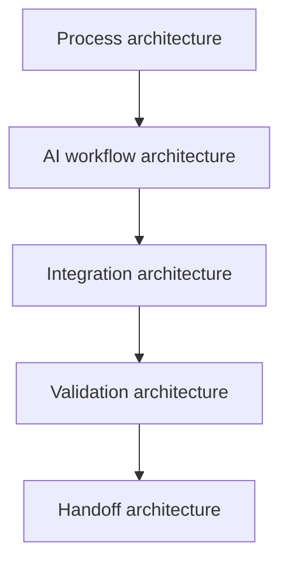

# Capabilities

Public-safe concept visual. Not a screenshot, not customer proof, not production evidence.

| Page signal | What to scan first |
| --- | --- |
| Role proof | process architecture, AI workflow architecture, integration architecture, validation architecture |
| Best proof | capability map, delivery outputs, public boundary |
| Safety boundary | no private exports, credentials, endpoints, workflow IDs, or unsupported claims |

## Purpose

This is a public-safe overview of what I can design, build, validate, and hand off as Founder of Aureus Automation Lab, AI Systems Architect, and builder of controlled AI operating systems for business execution. It describes capability areas and delivery outputs without exposing private systems, credentials, raw workflow exports, customer-like data, endpoints, POHODA internals, or production context.

## Why These Capabilities Matter Commercially

The capabilities are not listed as a technical inventory. They are the building blocks of better business execution.

They also create the sales path: audit the process, build the first controlled slice, prove it, hand it off, and then decide whether the client needs FinEcon, Aureus OS, premium web automation, or a monthly automation partner.

| Capability | Business reason to care |
| --- | --- |
| Automation Audit | Find the first valuable automation before wasting money on the wrong workflow |
| n8n workflow automation | Make repeated work faster, clearer, and easier to review |
| FinEcon / Invoice | Give owners better visibility into document, invoice, cost, and reporting flows |
| Aureus OS | Turn AI-assisted work into a repeatable company operating process |
| Premium AI Web + Automation | Explain the offer publicly and connect the message to the system behind it |
| Proof / evidence | Make the system easier to trust, sell, review, and improve |

## Source-Backed Capability Promise

Aureus capabilities should be presented as source-backed, not exaggerated:

| Claim type | Public-safe promise |
| --- | --- |
| What we can design | process maps, workflow architecture, review gates, AI roles, proof packs, handoff notes |
| What we can build | n8n automations, internal tool slices, document/data flows, premium public surfaces, AI-assisted workflows |
| What we can validate | input/output shape, review states, error paths, sensitive-action boundaries, public/private claim safety |
| What we will not fake | ROI guarantees, accounting correctness, certification, client results, or production readiness without separate evidence |

See the [source truth map](../proof/source-truth-map.md) for how public claims map back to Aureus source artifacts.

## Aureus Capability Stack

| Capability | Public-safe signal |
| --- | --- |
| Aureus AOP | Operating platform for GitHub/Codex delivery, n8n workflows, validation, evidence, and handoff |
| n8n workflow automation | Workflow-as-source discipline, import boundaries, activation approval |
| Supervisor / Azure capability | Demonstrated integration capability through internal runtime, smoke tests, and evidence-based validation |
| FinEcon / Invoice | Document and invoice workflow direction with review and POHODA boundaries |
| Web Studio / Experience | Public-safe product surfaces with design system, visual QA, claims review, and browser evidence |
| Proof / evidence | Action gates, egress review, scorecards, and proof packs |
| Automation Audit | Process diagnosis, first-slice scope, and buyer-ready implementation path |

## Capability Architecture Map

## Capability Groups

| Group | What it proves |
| --- | --- |
| Process architecture | I can identify ownership, decisions, handoffs, and failure points |
| AI workflow architecture | I can define where AI assists and where humans remain responsible |
| Integration architecture | I can connect tools through APIs, workflow states, and structured handoffs |
| Validation architecture | I can define tests, review states, evidence, and exception handling |
| Handoff architecture | I can make the system understandable after the builder leaves |

## Capability Cards

| Capability group | What it proves | Typical artifact |
| --- | --- | --- |
| Process architecture | I can identify ownership, decisions, handoffs, and failure points | Process map |
| AI workflow architecture | I can define where AI assists and where humans remain responsible | AI role / review state |
| Integration architecture | I can connect tools through APIs, workflow states, and structured handoffs | Integration map |
| Validation architecture | I can define tests, evidence, and exception handling | Proof checklist |
| Handoff architecture | I can make the system understandable later | Operating notes |

## Capability Map

| Capability | Problem signal | Possible solution | Proof / validation output |
| --- | --- | --- | --- |
| Business process discovery | Work is stuck in inboxes, spreadsheets, chats, memory, or unclear ownership | Process map, decision points, role boundary, first useful scope | Discovery notes, acceptance criteria, risk and privacy notes |
| AI-assisted workflow design | AI could help, but ownership and review are unclear | Assistant role, structured input/output, review queue, confidence and escalation rules | Example input/output shapes, eval checklist, approval boundary |
| Workflow orchestration | Manual routing, reminders, approvals, and handoffs are inconsistent | Trigger/routing states, retries, exception handling, status flow | Test cases, dry-run notes, sensitive-value workflow discipline |
| Document/data automation | Documents or records need extraction, classification, validation, or structured handoff | Intake model, parsing direction, structured ledger, review checklist, exception queue | Sample schema, validation checklist, owner review notes |
| Internal tools and control surfaces | Operators need one place to view, review, approve, or export work | Dashboard, admin panel, workflow form, status view, operating console | UI slice, state model, handoff notes, review checklist |
| Product prototype slices | An idea needs to become testable before a heavy build | First useful app slice, demo flow, landing page, dashboard concept | Feedback questions, demo path, next-step roadmap |
| Validation and proof packs | A workflow runs, but trust and evidence are weak | Test examples, audit notes, logs/evidence model, edge-case review | Proof pack, QA notes, exception states, review findings |
| Handoff and operating notes | Work depends too much on the builder or hidden context | Owner guide, runbook, known limits, next iteration plan | Operating notes, maintenance checklist, backlog |

## AI Automation Systems

Useful AI automation is controlled, reviewable, and testable. Example patterns include:

- classification assistant for triage or routing,
- review queue for owner decisions,
- approval flow for sensitive or final actions,
- confidence flags for low-certainty output,
- human-in-the-loop boundary for important decisions,
- evidence capture so the owner can see what happened and why.

## Internal Tools

Internal tools should make work easier to operate, not harder to explain. Example surfaces include:

- dashboards for process visibility,
- admin panels for controlled actions,
- workflow forms for structured intake,
- status views for queue and handoff states,
- export/reporting for reviewed outputs,
- operating console for daily workflow control.

## Document And Data Workflows

Document and data workflows need clear boundaries between intake, automation, validation, and owner review. A public-safe shape can include:

- intake from inboxes, drives, forms, or shared folders,
- extraction or classification into a structured format,
- structured ledger or review table,
- exception handling for incomplete or risky records,
- validation checklist for expected fields and edge cases,
- owner review before sensitive handoff or downstream import.

## Delivery Outputs

A serious first slice usually produces some combination of:

- process map,
- first useful build slice,
- acceptance criteria,
- review checklist,
- risk/privacy notes,
- validation examples,
- operating handoff,
- next-step roadmap.

## Public Boundary

This document does not include private systems, access details, client-like data, production infrastructure, raw workflow exports, internal implementation, credentials, private endpoints, workflow IDs, webhook URLs, or production settings.
