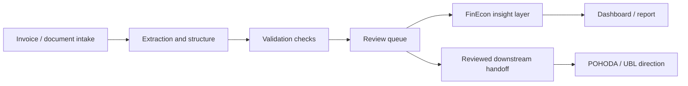

# FinEcon

**FinEcon is the Aureus financial and economic intelligence direction.**

It is designed for businesses that need clearer visibility into invoices, documents, cashflow, costs, revenue, margins, and reporting without turning AI into an uncontrolled accounting authority.

Public-safe source status: FinEcon is backed by a private Aureus source-of-truth workflow family. The public version describes the system shape without exposing workflow exports, exact internal routes, POHODA access details, runtime logs, or real documents.

## Why Choose FinEcon

Financial and document work is sensitive. It cannot be treated like a simple AI demo.

FinEcon is built around visibility and review: the owner should see what came in, what was extracted, what is uncertain, what needs approval, and what can move downstream.

| Problem | FinEcon direction |
| --- | --- |
| Invoices are scattered across inboxes, folders, and chats | Create a structured intake and review path |
| Manual copying slows the team down | Extract and prepare fields for review |
| Cashflow and costs are hard to see early | Build owner-facing summaries and reporting direction |
| Exceptions are missed | Track incomplete, risky, or uncertain records |
| POHODA or downstream finance systems require care | Keep final handoff reviewed and bounded |

## Product Direction

FinEcon helps structure financial and operational data so owners can review, understand, and act.

```text
documents / invoices / records
-> structured extraction
-> validation checks
-> review queue
-> bridge readiness
-> financial insight layer
-> dashboard / report / proof notes / handoff
```

The point is not to replace professional accounting. The point is to reduce manual confusion, improve visibility, and create reviewed handoff paths.

## What FinEcon Can Support

| Area | Example use | Review boundary |
| --- | --- | --- |
| **Invoice intelligence** | collect, structure, classify, and prepare invoice data | human review before downstream action |
| **Pocket document flow** | intake, status, review action, and company registration direction | no sensitive downstream action without approval |
| **Cashflow view** | understand expected inflows, outflows, and timing | owner interpretation |
| **Cost and revenue overview** | group costs, revenue, suppliers, customers, and periods | validation against source data |
| **Margin and profitability insight** | highlight patterns, anomalies, and questions | business review |
| **Monthly reporting** | draft management reports and summaries | owner approval |
| **POHODA / UBL direction** | prepare reviewed export or handoff shape | no silent final import; accountant validation remains separate |

## Business Value

FinEcon is useful when the owner wants:

- fewer document bottlenecks,
- faster invoice review,
- cleaner monthly reporting,
- better visibility before decisions,
- reviewed handoff to accounting-style systems,
- less dependence on memory and manual searching.

## Architecture Shape



## Why This Matters

Many small businesses do not lack effort. They lack a clean operating view.

Common problems:

- invoices are scattered,
- reporting is delayed,
- cashflow visibility is unclear,
- owner decisions depend on memory,
- documents require repeated manual transfer,
- exceptions are not tracked,
- accounting-style handoffs need care.

FinEcon is designed to make the flow visible, structured, and reviewable.

## Source-Backed Status

The private Aureus source-of-truth supports a stronger FinEcon story than a concept-only product:

- a 19-part sanitized workflow family,
- Pocket document intake, status, review action, bridge-start, and company-registration directions,
- reviewed bridge handoff and runtime readiness direction,
- proof-pack/writeback and proof-publisher direction,
- preflight validation and operations-signal checks,
- explicit accountant validation and cleanup boundaries.

This means the public offer can be described as a source-backed paid pilot direction. It should not be described as fully accountant-approved production accounting software.

## AI Role In FinEcon

AI may assist with classification, extraction, summarization, anomaly notes, report drafts, question generation, and exception explanation.

AI should not silently decide accounting correctness, tax treatment, legal interpretation, or final financial truth.

## Public-Safe Proof

Public proof can show architecture diagrams, example schemas, review-state designs, sanitized invoice/document flow, validation checklists, dashboard direction, and handoff boundaries.

Private material stays private: real invoices, credentials, POHODA access, production logs, private endpoints, customer-like data, accounting decisions, and source financial records.

For the public-safe evidence summary, see [FinEcon source-backed status](../proof/finecon-source-backed-status.md).

## FinEcon In One Sentence

**FinEcon turns scattered financial and document work into a reviewed intelligence layer for clearer business decisions.**
