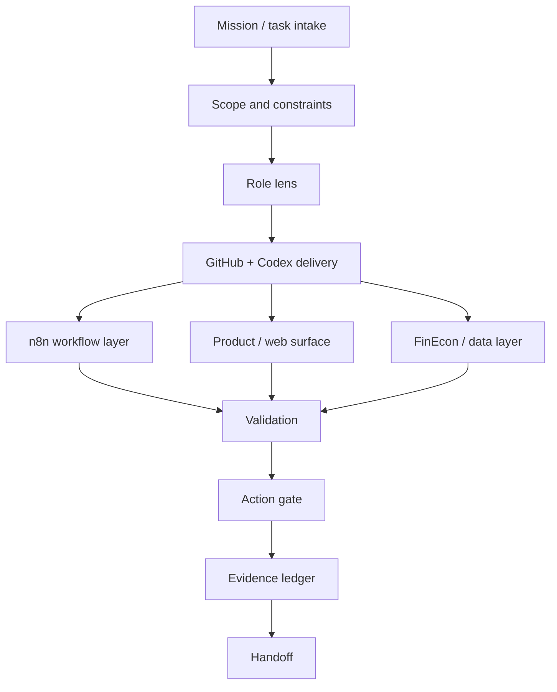

# Aureus OS / Autonomous Operating Platform

**Aureus OS is the operating layer behind Aureus Automation Lab.**

It is a system for turning AI-assisted work into scoped, reviewed, validated, and handoff-ready execution.

## Why A Company Would Want Aureus OS

AI tools can produce output quickly. That is not the same as running a company better.

Aureus OS is for teams that want AI, workflows, Git, documentation, review, validation, and owner approval to work as one operating model.

| Without an operating system | With Aureus OS |
| --- | --- |
| AI creates drafts, but nobody owns final truth | Every task has scope, owner, review, and evidence |
| Work is spread across tools | Work moves through a defined operating path |
| Automations are hard to trust | Outputs are validated and documented |
| Public messaging is disconnected from delivery | Website, content, workflows, and proof share one source of truth |
| Scaling depends on memory | The system creates repeatable execution habits |

## Why Aureus OS Exists

AI-assisted work can move fast, but speed without structure creates risk.

Aureus OS is designed around a simple question:

> How do we make AI-assisted delivery controlled enough that a serious business can understand, review, and operate it?

## Core Architecture

## Operating Layers

| Layer | Purpose | Output |
| --- | --- | --- |
| **Mission contract** | define goal, constraints, risk, and acceptance criteria | task brief |
| **Role lens** | decide how AI should behave for the job | architect, reviewer, builder, QA |
| **Source-controlled delivery** | keep changes reviewable | branch, PR, commit, docs |
| **Workflow layer** | automate repeatable process states | n8n workflow / state map |
| **Supervisor / validation** | check output before trust | tests, review checklist, evidence |
| **Action gate** | prevent unsafe downstream action | approval boundary |
| **Evidence ledger** | record what happened and why | proof notes, logs, run summary |
| **Handoff** | make the system understandable after build | operating guide |

## What Aureus OS Controls

Aureus OS is not a single app screen. It is a delivery and operating model that can support:

- AI-assisted build work,
- GitHub/Codex delivery,
- n8n workflows,
- sales operations,
- finance/document workflows,
- public product surfaces,
- validation and QA,
- evidence collection,
- handoff and next-step planning.

## Design Principles

1. **Scope before output**  
   Every useful build starts with a clear mission, constraints, and expected evidence.

2. **AI assists, owners approve**  
   AI can create drafts and suggestions. Sensitive actions remain owner-controlled.

3. **Work should be reviewable**  
   GitHub, PRs, docs, validation, and workflow source matter.

4. **Validation before trust**  
   Output is not complete just because it was generated.

5. **Evidence beats vibes**  
   A system should show what happened, what was checked, and what remains risky.

6. **Handoff matters**  
   The system should remain understandable after the builder leaves.

## Aureus OS In One Sentence

**Aureus OS turns AI-assisted work into controlled execution with scope, review, validation, evidence, and handoff.**
