# Visual Review

The visual target is a premium AI automation architecture portfolio, not a documentation archive.

For the premium root version, see [VISUAL_REVIEW.md](../../VISUAL_REVIEW.md).



## First Impression Target

```text
Robert Kolesar / KimiAoki
AI Automation Solution Architect
controlled AI automation systems
manual work -> reviewed workflow -> evidence-backed output
```

## Checklist

- [x] clear first impression
- [x] one-line positioning visible
- [x] one main architecture visual
- [x] no overclaiming
- [x] no private data
- [x] public demo flow exists
- [x] offer menu exists
- [x] GitHub-safe SVGs render without external images or fonts

## Visual Rules

- Use public-safe SVG or intentional committed images.
- Do not depend on stock photos or external image URLs.
- Do not show fake dashboards, fake metrics, private screenshots, customer-like data, or certification-style badges.
- The static frame must make sense even if animation does not run.

## Existing Visual Assets

| Asset | Purpose |
| --- | --- |
| `assets/public-ai-automation-operating-flow.svg` | Main public architecture flow |
| `assets/image2/profile-public-architecture-hero.png` | Previous concept hero |
| `assets/image2/n8n-workflow-governance.png` | Workflow governance concept |
| `assets/image2/public-private-boundary.png` | Public/private boundary concept |
| `assets/image2/supervisor-validation-capability.png` | Supervisor validation concept |

Future visuals should support the same core story: business signal, mission, workflow, review, evidence, and business output.
