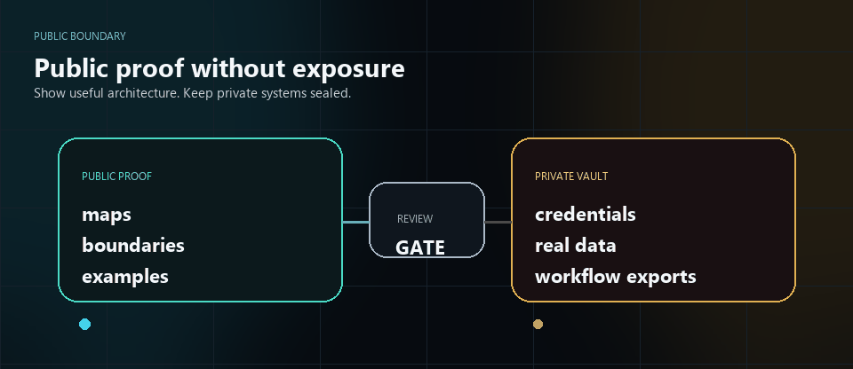

# Public Proof Showroom

This folder is the public proof showroom for Aureus Automation Lab.

Public proof means architecture, workflow maps, state models, examples, and safety boundaries that can be reviewed without exposing private implementation.

It is not customer proof, production proof, or a claim of promised results.

## Proof Packages

| Package | What it shows | Start here |
| --- | --- | --- |
| **Sales Machine** | a safe sales workflow where AI drafts and humans approve | [Sales Machine](sales-machine/README.md) |
| **FinEcon** | a reviewed invoice/document intelligence flow with finance boundaries | [FinEcon](finecon/README.md) |
| **Aureus OS** | an operating model for controlled AI-assisted company work | [Aureus OS](aureus-os/README.md) |

## Use Case Showcase Layer

For client conversations, the proof packages are translated into a practical use-case system:

- [Use Case Offer Sheet](../docs/use-cases/AUREUS_CLIENT_USE_CASE_OFFER_SHEET.md)
- [Use Case Showcase Copy V5](../docs/use-cases/AUREUS_USE_CASE_SHOWCASE_COPY_V5.md)
- [Slovak Use Case Showcase Copy V5](../docs/use-cases/AUREUS_USE_CASE_SHOWCASE_COPY_V5_SK.md)
- [Use Case Showcase V6 Design Spec](../docs/use-cases/AUREUS_USE_CASE_SHOWCASE_DESIGN_SPEC_V6.md)
- [Use Case Git Proof Map](../docs/use-cases/AUREUS_USE_CASE_GIT_PROOF_MAP.md)
- [FinEcon Pocket / Bridge One-Pager](../docs/use-cases/FINECON_POCKET_BRIDGE_USE_CASE_ONE_PAGER.md)

## What This Proves

These proof packages show that Aureus can describe systems clearly:

- what starts the work,
- what AI may help with,
- what humans approve,
- what evidence is kept,
- what stays private,
- where the workflow can be reviewed before action.

## What This Does Not Claim

This folder does not claim:

- ROI promises,
- customer results,
- production deployment,
- official certification,
- accounting correctness,
- tax or legal advice,
- trading performance,
- enterprise compliance,
- replacement of professional review.

## What Stays Private

Private implementation stays private:

- secrets,
- credentials,
- webhook URLs,
- private endpoints,
- raw n8n workflow exports,
- private workflow IDs,
- private prompts,
- real invoices,
- real leads,
- inbox data,
- POHODA access details,
- production logs,
- private screenshots,
- client-like records.

## How To Review

Start with the package that matches your question:

- sales and follow-up: [Sales Machine](sales-machine/README.md),
- invoices and finance/document review: [FinEcon](finecon/README.md),
- AI-assisted work control: [Aureus OS](aureus-os/README.md).

Each package includes a workflow or operating map, a boundary model, and a fictional buyer example.
