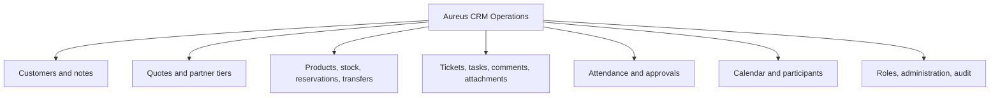

# Aureus CRM Operations Architecture

## Layers

| Layer | Responsibility |
| --- | --- |
| Product UI | Role-aware views for operations, sales, inventory, work, attendance, calendar, and administration |
| API | Input handling, domain transitions, validation, authorization context, and response shaping |
| Domain services | Customer/contact work, quotes, tickets/tasks, inventory, attendance, calendar, and administration |
| Persistence | SQLite schema, tracked seed, foreign-key enforcement, WAL mode, and state queries |
| Evidence | Audit events, tests, smoke checks, build receipts, and deployment notes |

## Domain Coverage

The architecture is deliberately modular at the domain boundary while remaining one deployable demo system. That makes cross-domain transitions visible without claiming microservice complexity that the proof does not need.

## Security And Data Boundary

- all records are synthetic,
- production writes are disabled in the implementation contract,
- live integrations are reported as zero,
- credentials and internal endpoints are excluded from this package,
- public files describe behavior without publishing the private implementation.
