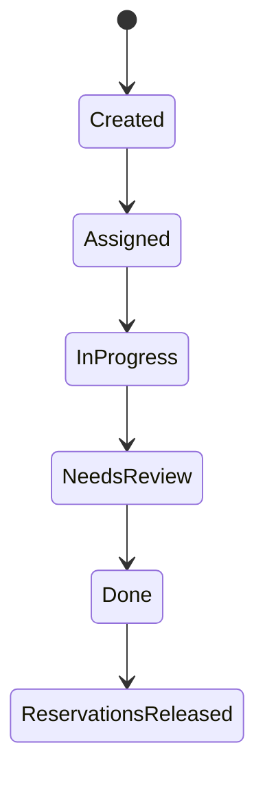

# Aureus CRM Operations State And Audit Model

The CRM proof is stateful. It is not only a visual dashboard.

## Example Transition

Exact transitions vary by operation, but the implementation contains logic for work ownership, task progression, parent-task automation, approval states, inventory reservation, and reservation release.

## Audited Event Families

- ticket and task creation,
- automatic progress and completion transitions,
- inventory reservation and release,
- quote and inventory operations,
- attendance requests and decisions,
- calendar creation and participant responses,
- administrative user actions,
- demo authentication and controlled exports.

Audit records connect actor, event, entity type, entity identifier, detail, and timestamp. Public proof describes that shape without exposing synthetic records or private runtime logs.

## Concrete Inventory Invariant

When all required work steps complete, the parent work item can move to done and active demo reservations for that work item are released. The release updates state, records an audit event, and creates a system-visible explanation.

This is a product-behavior claim backed by implementation, not a claim about production warehouse integration.
