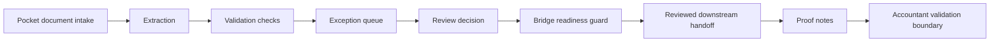

# FinEcon Invoice Review Flow

This is a public-safe invoice/document workflow. It reflects the public FinEcon direction without including real invoices, POHODA credentials, private endpoints, production logs, or accounting correctness claims.

## Stage Explanation

| Stage | What it means |
| --- | --- |
| Pocket document intake | Documents arrive through a controlled intake direction and become reviewable records. |
| Extraction | AI may suggest candidate fields such as supplier, date, amount, due date, or document type. |
| Validation checks | The system checks whether required fields are present and whether something needs attention. |
| Exception queue | Missing, uncertain, or inconsistent records are separated for review. |
| Review decision | A human can approve, reject, or send the record back for correction. |
| Bridge readiness guard | The system checks whether a downstream handoff is allowed and safe to attempt. |
| Reviewed downstream handoff | Only reviewed data should move toward accounting-style or reporting workflows. |
| Proof notes | The system records what happened, what was reviewed, and what still needs attention. |
| Accountant validation boundary | Accounting-sensitive conclusions remain subject to accountant/professional review where required. |

## Public-Safe Boundary

This flow explains review structure. It does not claim tax, legal, or accounting correctness.
