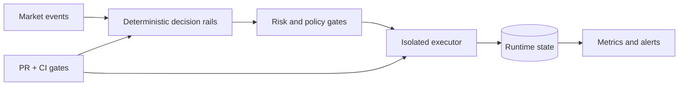

# Aureus Trading Infrastructure

This is a public-safe architecture proof for a private **paper-run** trading infrastructure project.

The engineering focus is deterministic operation, risk isolation, observability, auditability, and strict change control. This page does not publish strategy logic, credentials, deployment targets, or performance data.

## Architecture Snapshot

## Source-Backed Signals

- event-driven decision stages,
- an isolated executor as the only credential-bearing component,
- runtime state separated from source control,
- Prometheus, Alertmanager, and Grafana observability,
- deterministic smoke checks before deployment progress,
- fast-forward-only, pull-only server discipline,
- safe-path automation separated from risk-path manual review,
- explicit rollback and incident runbooks.

Read the [risk and validation boundary](risk-boundary.md).

## Correct Public Status

**Private engineering infrastructure in paper-run / validation mode.**

This package is architecture evidence. It is not financial advice, a live trading claim, a performance claim, or an invitation to copy a strategy.
