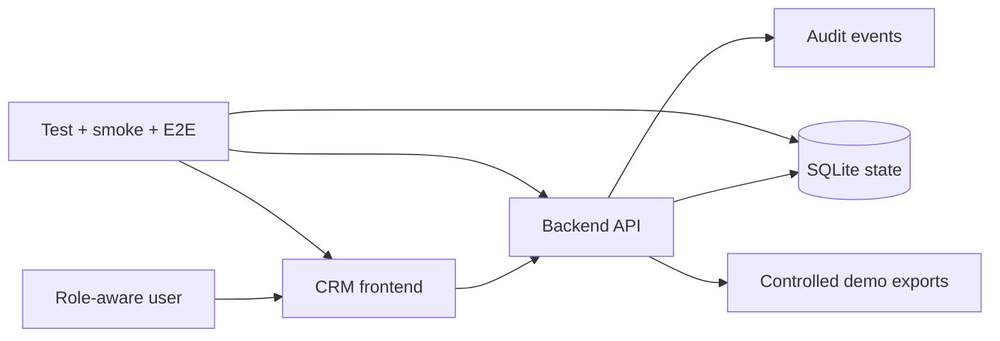

# Aureus CRM Operations

This package is a public-safe proof of a full-stack synthetic CRM and operations platform. `CRM Business Operations Platform` is the historical implementation label; **Aureus CRM Operations** is the canonical public name.

It demonstrates product architecture across a frontend route, backend API, SQLite database, role-aware operations, tests, and deployment support. It does not expose the private source, synthetic records, internal screenshots, credentials, or runtime endpoints.

## Source-Backed Snapshot

| Evidence | Verified source fact |
| --- | --- |
| Merged implementation package | 49 changed files and 21,472 added lines |
| Frontend | Dedicated CRM platform route with business-operation views |
| Backend | Independent API service with stateful domain operations |
| Database | SQLite created from a tracked SQL seed; foreign keys and WAL enabled |
| Operational domains | Customers, notes, products, inventory, reservations, transfers, quotes, promotions, partner tiers, tasks, tickets, attendance, calendar, roles, administration, and audit |
| Validation | Backend tests, API smoke, frontend build, Playwright route test, SQL seed import/query, and secret scan |

## System Shape

Read the [architecture](architecture.md), [state and audit model](state-and-audit-model.md), and [validation boundary](validation-boundary.md).

## What This Proves

- requirements can be translated into a coherent domain model,
- frontend, API, data, roles, and workflow state can be delivered as one product slice,
- business events are auditable,
- inventory reservations have lifecycle behavior,
- the implementation is packaged with automated validation and deployment guidance.

## What This Does Not Claim

- no real customer data,
- no production writes,
- no live ERP, e-commerce, email, or payment integration,
- no production-scale or customer-outcome claim,
- no claim that a synthetic demo is already a deployable customer CRM.

The correct status is **source-backed full-stack synthetic product proof**.
