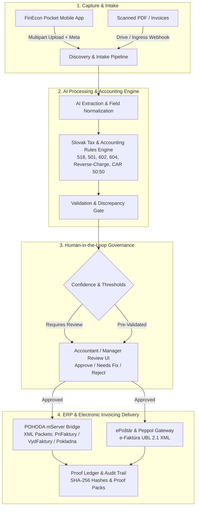

# FinEcon Public Proof Showroom

This proof package demonstrates the architectural, functional, and governance model of the **FinEcon Ecosystem** (FinEcon Core, FinEcon Pocket, and ePoštár Gateway).

It serves as a public-safe reference of how controlled financial automation operates without exposing proprietary secrets, real client financial records, private network endpoints, or unredacted credentials.

---

## The End-to-End System Workflow

---

## Architectural Highlights

### 1. FinEcon Core & POHODA Bridge
* **Schema-Compliant XML Engine:** Generates native POHODA XML structures with explicit document numbers, accounting dates, VAT classifications, and KV DPH codes.
* **Deterministic Accounting Rules:**
  * Transport and services mapped to `518`.
  * Material and consumable goods mapped to `501`.
  * Self-charge / reverse-charge handling with paired internal documents (`aInt`/`bInt`) and appropriate VAT classifications (`DDsluz`/`PDsluz`, `DDnadEU`/`PDnadEU`).
  * Fuel and automotive splits applying standard statutory apportionment (`501`/`501999` and `518`/`518999`).
* **Dry-Run & Guardrails:** All mutations require explicit runtime permissions, preflight health verification, and connection validation before ledger commitment.

### 2. FinEcon Pocket (Mobile Client)
* **Built with Flutter:** High-performance, cross-platform mobile experience with a dark aesthetic and instant responsiveness.
* **Resilient Sync Architecture:** Offline-first transaction queue with deterministic retry backoff and local draft perzistence.
* **Direct Review in Hand:** Real-time visibility into invoice status, extracted data validation, and one-tap approvals from anywhere.

### 3. ePoštár / e-Faktúra Gateway
* **Peppol BIS Billing 3.0 & EN 16931:** Native generation of compliant European standard e-invoices.
* **HMAC-SHA256 Signed Ingress:** Secure webhook receiver protecting incoming invoice events with cryptographic timestamp verification and replay protection.
* **Non-Repudiation Ledger:** Downloads provider-stored UBL artifacts, verifies byte integrity, and calculates SHA-256 signatures for permanent legal archiving.

---

## Public-Safe Boundaries & Privacy Guarantee

This public showroom strictly adheres to the **Aureus Zero-Leakage Policy**:

* ❌ **No Private Data:** Zero real company names, real identification numbers (IČO/DIČ), banking details, or invoice sums.
* ❌ **No Credential Exposure:** All API keys, webhook signing secrets, and OAuth tokens are strictly excluded and managed via isolated secret managers.
* ❌ **No Internal Infrastructure Exposure:** Production IP addresses, internal DNS records, and private drive IDs are fully redacted.
* ✅ **Focus on Architecture:** Demonstrates system maturity, reliability, data contracts, and error resilience.

---

## Related Documentation

* [FinEcon Product Overview](../../docs/products/finecon.md)
* [Invoice Review & State Model](invoice-review-flow.md)
* [Review & Authorization Boundaries](review-boundary.md)
* [Buyer & Enterprise Persona Guide](buyer-example.md)
