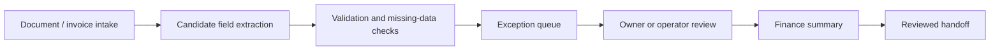

# FinEcon Invoice Review Flow

This is a public-safe invoice/document workflow. It does not include real invoices, private endpoints, production logs, or accounting correctness claims.

## Stage explanation

| Stage | What it means |
| --- | --- |
| Document / invoice intake | Receipts, supplier invoices, issued invoices, income/cost documents, and supporting records enter a reviewable flow. |
| Candidate field extraction | AI may suggest fields such as supplier, customer, date, document number, amount, due date, category, and status. |
| Validation and missing-data checks | The system checks whether required information is present and whether something needs attention. |
| Exception queue | Missing, uncertain, duplicate, inconsistent, or unclear records are separated for review. |
| Owner or operator review | A person checks important fields, exceptions, and next actions before handoff. |
| Finance summary | The system can prepare a plain-language summary of open items, upcoming payments, missing documents, or review needs. |
| Reviewed handoff | Reviewed data can be prepared for an accounting application or accountant workflow. |

## Public-safe boundary

This flow explains review structure. It does not claim tax, legal, or accounting correctness.
