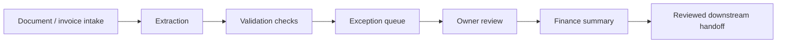

# FinEcon Invoice Review Flow

This is a public-safe invoice/document workflow. It does not include real invoices, private endpoints, production logs, or accounting correctness claims.

## Stage explanation

| Stage | What it means |
| --- | --- |
| Document / invoice intake | Documents arrive from approved sources and become reviewable records. |
| Extraction | AI may suggest candidate fields such as supplier, date, amount, due date, or document type. |
| Validation checks | The system checks whether required fields are present and whether something needs attention. |
| Exception queue | Missing, uncertain, or inconsistent records are separated for review. |
| Owner review | A human reviews important fields, exceptions, and next actions. |
| Finance summary | The system can prepare a plain-language summary of open items, upcoming payments, or review needs. |
| Reviewed downstream handoff | Only reviewed data should move toward downstream accounting-style or reporting workflows. |

## Public-safe boundary

This flow explains review structure. It does not claim tax, legal, or accounting correctness.
