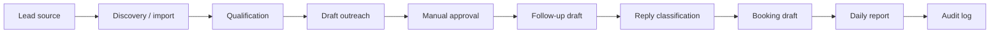

# Sales Machine Workflow Map

This is a public-safe workflow map. It does not include real leads, message data, workflow IDs, automation JSON, endpoints, or credentials.

## Stage explanation

| Stage | What it means |
| --- | --- |
| Lead source | A website form, referral, event list, inbound message, or approved prospect source creates a lead. |
| Discovery / import | The lead becomes a structured record. |
| Qualification | The system checks fit, missing information, and next-step readiness. |
| Draft outreach | AI may prepare a first message draft. |
| Manual approval | A person reviews and approves before anything external happens. |
| Follow-up draft | AI may prepare a follow-up draft when a lead is due. |
| Reply classification | Replies can be sorted into positive, negative, unclear, or blocked. |
| Booking draft | AI may prepare a next-step or meeting response draft. |
| Daily report | The owner sees activity, blocked items, and next steps. |
| Audit log | The system keeps evidence of state and decisions. |

## Public-safe boundary

This map explains the workflow shape only. It does not expose private implementation.
