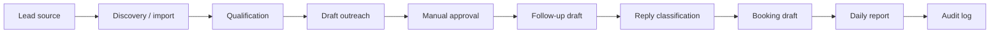

# Sales Machine Workflow Map

This is a public-safe workflow map. It does not include real leads, inbox data, workflow IDs, Gmail details, n8n JSON, endpoints, or credentials.

## Stage Explanation

| Stage | What it means |
| --- | --- |
| Lead source | A website form, referral, event list, inbound message, or approved prospect source creates a lead record. |
| Discovery / import | The lead is added to a reviewable list without exposing private inbox or CRM details publicly. |
| Qualification | AI may suggest fit, category, and next action; the business can review before outreach. |
| Draft outreach | AI prepares a draft message, but does not send it blindly. |
| Manual approval | A human reviews the lead, message, tone, and context before anything external happens. |
| Follow-up draft | AI prepares a follow-up draft when a next step is needed. |
| Reply classification | Replies can be labeled as positive, negative, unclear, not fit, or do-not-contact. |
| Booking draft | If a prospect is interested, AI may prepare booking or next-step language for approval. |
| Daily report | The owner receives a simple summary of activity, open decisions, and next actions. |
| Audit log | The system keeps a review trail: what was drafted, approved, skipped, or still blocked. |

## Public-Safe Boundary

This map is conceptual but concrete. It shows the business logic without exposing private implementation.
